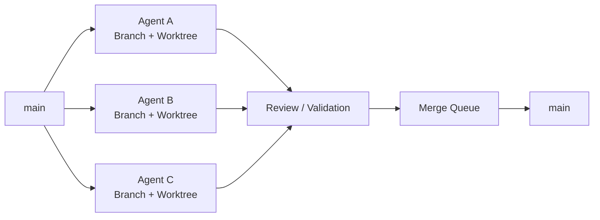
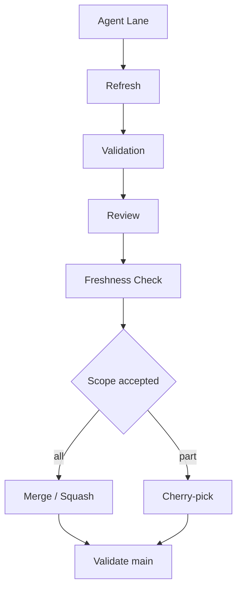
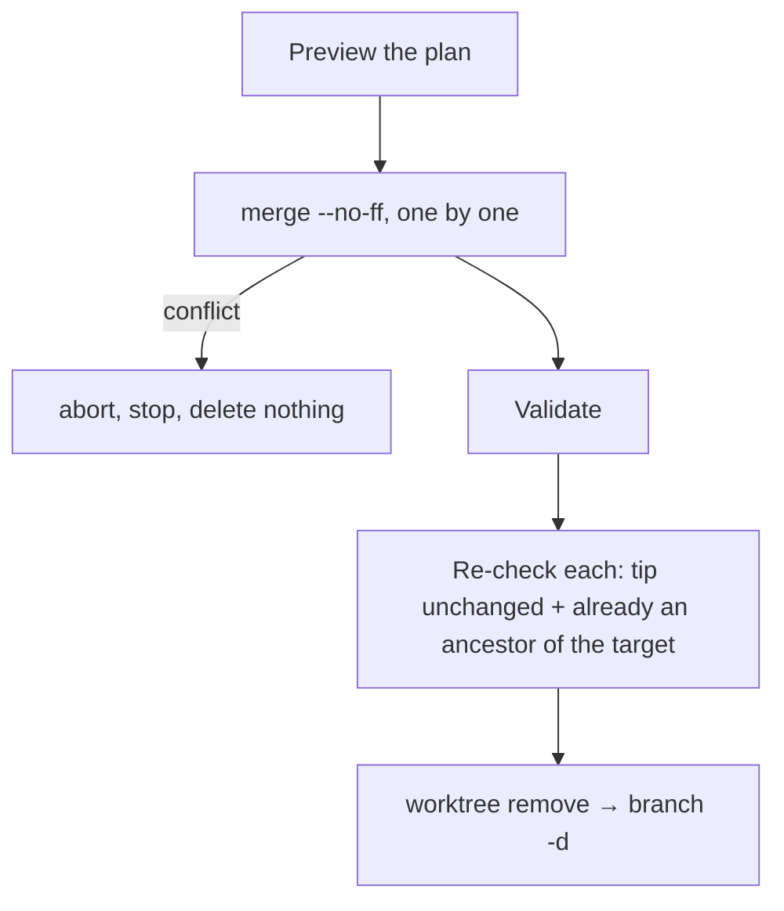
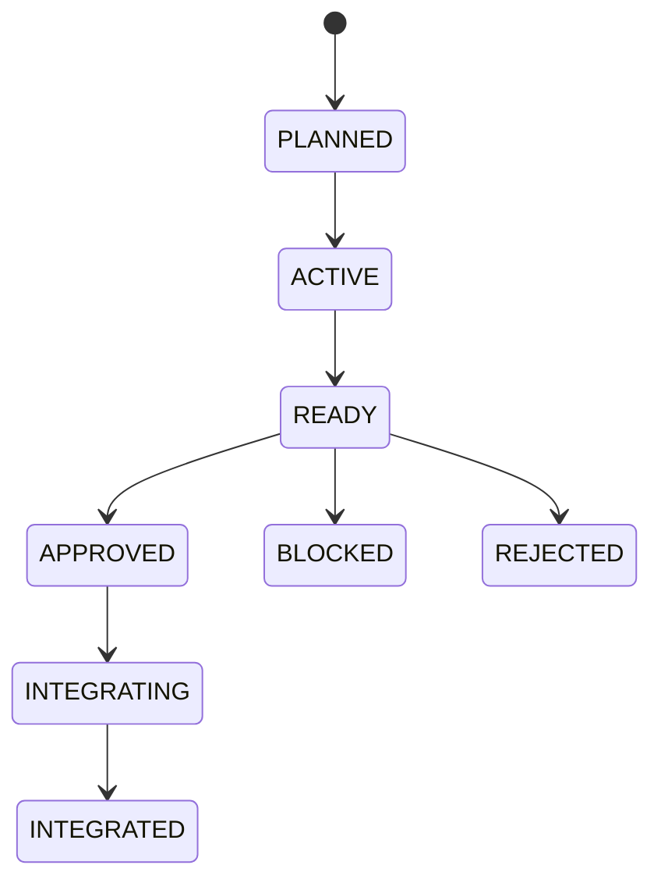

# Multi-Agent Git Orchestrator Skills

[English](README.en.md) | [中文](README.md)

> **Let multiple AI agents safely develop the same Git repository in parallel.**

A Git workflow skill for coding agents — Claude Code, Codex, Cursor, OpenCode, Hermes, and any host that supports the Agent Skills format.

It actively inspects the current repository's **branch / worktree / commit / ahead-behind / dependency** state, then helps the agent decide:

- Which tasks can safely run in parallel
- Which worktrees can be reused or reclaimed
- Which branches should be rebased vs merged
- Which commits are worth cherry-picking
- Which branches are now safe to delete
- How to stop several agents from destroying `main`


---

## Plain-language primer (start here if you are new to Git)

> No Git background needed. Think of several people editing the same important document.

| Word you will see | In plain words | Office analogy |
|---|---|---|
| repository | The folder that holds the whole project and its full history | A filing cabinet of documents and every revision |
| commit | One recorded change, with an ID | A saved version of the document |
| branch | An independent line of changes; lines do not disturb each other | Each person's own revised draft |
| `main` | Usually the "official, stable" line | The finished, published version |
| merge | Bring the changes of one branch into another | Fold several drafts into the master copy |
| worktree | The folder where one branch is being edited | Each person's own desk |
| remote | The copy stored online (for example on GitHub) | The company's shared-drive backup |
| preview / apply | Look at the plan first, then decide to really do it | Read the renovation plan, then say "go" |

**Every command follows one rule: look first, act only when told.** The three commands that can change your repository (`/GitIntegrate`, `/GitCleanup`, `/GitConverge`) act only when you explicitly ask, and they stop and explain whenever they are unsure instead of pushing on.

### How do I write a command?

Type the command in Claude Code, followed by optional "arguments" separated by spaces:

```text
/CommandName  required-thing  --switch  --switch-with-a-value value
```

- Things in `<angle brackets>` are **required**. Replace them with your own value, for example `<branch>` becomes `agent/release`.
- Things in `[square brackets]` are **optional**.
- Anything starting with `--` is a "switch". Some work on their own (`--apply`); some need a value after them (`--lang English`).
- If a value contains a space, put it in quotes: `--lang "Brazilian Portuguese"`.
- The order of switches does not matter.
- `--help` is always safe: it **only shows the instructions and never reads or changes your repository**.

---

## Three arguments that work everywhere

These three work the same way in every command that supports them. Learn them once and every command below gets easier.

### `--help`: just show the instructions

**How to write it**: `/CommandName --help`. It can go anywhere after the command and can be combined with other arguments; as soon as `--help` is present, only the instructions are shown.

```text
/GitConverge --help
/GitIntegrate agent/auth --strategy squash --help      ← other arguments are ignored; only the help is shown
/GitRecon --help --lang English                         ← show the help in English
```

| Item | Explanation |
|---|---|
| What it does | Shows how to write the command, what every argument means, what happens when you leave them out, and a few examples, then stops |
| What it never does | Never reads your repository, never runs Git, never changes anything |
| When to use it | You forgot the syntax, you are unsure what an argument means, or it is your first time with a command |
| Which commands | All six |

> **When in doubt, add `--help` first. It is completely safe.**

---

### `--remote`: ask the internet for the latest state first

**How to write it**: `/CommandName --remote`. It is a plain switch; no value follows it.

```text
/GitRecon --remote
/GitAnalyze agent/auth --remote
/GitRecommend which branches should merge first --remote
```

**What is the difference with and without it?** Suppose your computer noted yesterday that "online `main` is at change #100", and today a colleague uploaded 3 more changes.

| Written as | How it judges | Likely consequence |
|---|---|---|
| Without `--remote` (default) | Uses only the records **already on your computer**: "online `main` is at #100" | Fast and needs no network, but the conclusion may be stale |
| With `--remote` | First updates the records, learns "online `main` is now at #103", then concludes | A fresher conclusion; needs the network and takes a little longer |

**What exactly does it do?** It asks Git to refresh the list of online branches and their latest positions (for example `git fetch --prune`), and to drop old records of branches that were deleted online.
**What it never does**: it never merges online changes into your branches, never changes your local branches or files, and never uploads anything.

| Item | Explanation |
|---|---|
| Which commands | Only the three read-only ones: `/GitRecon`, `/GitAnalyze`, `/GitRecommend`. After any other command it counts as an unknown option, and you get an error and the help |
| No network or no access | It says the refresh failed and notes that its conclusions are based on the records already on your computer |
| When to add it | You just heard a colleague uploaded something, or you must decide based on how the online copy looks right now |

---

### `--lang <language>`: choose the language of the reply

**How to write it**: `--lang language`. A language **must** follow `--lang`, separated by a space.

```text
/GitRecon --lang English
/GitAnalyze agent/auth --lang 日本語
/GitConverge agent/release --lang "Brazilian Portuguese"
/GitRecommend which branches should merge first --lang en
```

**Which languages can I write?** A name or a common code; almost any language the model can write works:

| Language you want | Write it as |
|---|---|
| Chinese | `中文`, `简体中文`, `zh` (also the default when you write nothing) |
| English | `English`, `en` |
| Japanese | `日本語`, `ja` |
| Korean | `한국어`, `ko` |
| French / German / Spanish | `Français` / `fr`, `Deutsch` / `de`, `Español` / `es` |
| A name with a space | Put it in quotes: `"Brazilian Portuguese"` |

**What does it control?** All the text it writes back to you: explanations, reports, questions to you, error messages, and the text of `--help`.

**What is never translated?** Command names, option names, branch names, file paths, commit IDs, Git commands, and status codes such as `BLOCKED_DIRTY` or `MERGE`, because you may need to copy or search for them exactly. It may add a short gloss in your language next to them, for example `BLOCKED_DIRTY` (unsaved edits in its worktree).

| Item | Explanation |
|---|---|
| If you leave it out | **The reply is in Chinese**, even if you asked in English |
| Where to put it | Anywhere after the command. In `/GitRecommend which branches should merge first --lang English`, `--lang English` is taken out first, so your question is "which branches should merge first" |
| If you write it wrongly | If nothing follows `--lang`, or what follows is not a language (for example `--lang xyz123`), it tells you what is wrong in Chinese and shows the usage, **without running the command** |
| Does it change the result? | No. Only the language of the reply changes; the checks and judgments are identical |
| Which commands | All six |

---

## Why

Multi-agent development usually collapses into this:

```text
Agent A ─┐
Agent B ─┼── one shared directory ── conflicts / overwrites / tangled history
Agent C ─┘
```

This skill turns it into this:



The core principle:

> **One Agent Lane = One Branch + One Worktree**

---

## Capabilities

| Capability | What it does |
|---|---|
| Repository Recon | Actively inspects branches, worktrees, HEAD, dirty state, ahead/behind |
| Dependency DAG | Works out which agent tasks block which |
| Worktree Isolation | Stops multiple agents from mutating the same checkout |
| Rewrite Safety | Decides when a rebase is allowed and when history is frozen |
| Selective Integration | Picks merge / squash / cherry-pick based on actual state |
| Freshness Gate | Blocks integration when `main` moved after your review |
| Merge Queue | Serializes writes into the shared integration branch |
| Safe Cleanup | Identifies completed branches and worktrees safely |
| Safe Rollback | `reset` for private history, `revert` for shared history |

---

## The six commands

| Command | In one sentence | Does it change your repository? |
|---|---|---|
| `/GitRecon` | A health check of the whole repository | No, look only |
| `/GitAnalyze` | A deep look at one branch or worktree | No, look only |
| `/GitRecommend` | Suggests what to do next, from real state | No, advice only |
| `/GitIntegrate` | Lands one agent's work behind a safety gate | Yes, after a series of checks |
| `/GitCleanup` | Removes finished branches and worktrees | Not by default; only with `--apply` |
| `/GitConverge` | Folds every branch into one and keeps only `main` and it | Not by default; only with `--apply` |

Every command accepts `--lang <language>` (reply language, Chinese by default) and `--help` (instructions only); the three read-only commands also accept `--remote`. Their details are in "Three arguments that work everywhere" above, so each command below describes only the arguments **it alone** has.

> **Not sure which branches and worktrees you have?** Run `/GitRecon` first and it lists them. In a terminal, `git branch` lists the branches and `git worktree list` lists the worktrees.

---

### `/GitRecon` — read the room

**A health check of the whole repository. Look only.**

Use it when you have just taken over a project, several agents are editing at once, or you do not know which branches and worktrees exist.

```text
/GitRecon
/GitRecon --remote
/GitRecon --lang English
```

It reports on:

```text
Worktrees        how many, and which branch each one is on
Branches         their latest positions, and whether an online branch exists for each
HEAD             where you are standing right now
Dirty            which worktrees hold half-edited files
Ahead / Behind   how many changes more or fewer than the main line
Detached         which worktrees are not attached to any branch
Remote tracking  which online branch each local branch follows
Merge candidates which branches are already part of the main line
Risk             things you should look at
```

#### The arguments in detail

`/GitRecon` has no required argument; just type it. Optional arguments:

| Argument | How to write it | What it does |
|---|---|---|
| `--remote` | `/GitRecon --remote` | Refresh the online reference data first; see "Three arguments that work everywhere" |
| `--lang <language>` | `/GitRecon --lang English` | Reply in that language; Chinese if omitted |
| `--help` | `/GitRecon --help` | Show the instructions only |

---

### `/GitAnalyze <target>` — understand one lane

**A deep look at one branch or one worktree. Look only.** Use it to answer "can I merge or delete this?".

```text
/GitAnalyze agent/auth
/GitAnalyze ../wt-auth --remote
```

#### The arguments in detail

**`<branch or worktree path>` (required): what to inspect**

| Item | Explanation |
|---|---|
| What to write | Either works: a **branch name** (as `git branch` shows it, for example `agent/auth`) or the **folder path of a worktree** (for example `../wt-auth`; a full path is fine too) |
| Where to find names | Run `/GitRecon`; the list has every branch name and worktree path |
| If you leave it out | It does not guess; it asks which one to inspect and shows the help |
| If you get it wrong | It says it cannot find that branch or path and asks you to confirm; it does not inspect something else |
| A branch and a path share a name | It decides from the facts of the repository; if the answer would change the conclusion, it tells you about the ambiguity instead of picking one |

**`--remote` (optional)**: refresh the online reference data first; see "Three arguments that work everywhere". **`--lang <language>` (optional)**: reply language, Chinese by default.

#### What it checks, and how to read the report

It finds the common starting point with the main line, how far ahead or behind the branch is, its unique changes, the files it touches, whether other branches depend on it, and whether its history may be rewritten. It ends with a verdict for each of merge, rebase, cherry-pick, squash, and cleanup/delete: safe or not. Illustrative:

```text
agent/auth

Ahead:     3          ← 3 changes more than the main line
Behind:    2          ← 2 changes fewer (the main line has new changes it does not have yet)
State:     DIVERGED   ← each side has changes the other lacks: the lines have "forked"
Depends:   agent/core ← it is built on top of agent/core
Rewrite:   FROZEN     ← do not rewrite its history; branches that depend on it would break

Recommendation:
Do not rebase directly (that rewrites history)
Bring the main line in first, then validate again
```

---

### `/GitRecommend [goal]` — decide what happens next

**Advice from the real state of the repository. Advice only.**

Use it when you are unsure what to do next, for example "how should I split work between 3 agents?".

```text
/GitRecommend
/GitRecommend how should I arrange 3 agents
/GitRecommend which branches should merge first --remote
```

#### The arguments in detail

**`[goal]` (optional): your question or what you want to achieve**

| Item | Explanation |
|---|---|
| How to write it | Just write it in your own words after the command; **no quotes needed**, any length |
| If you leave it out | You get general next-step advice covering every branch and worktree |
| How to write a good one | **The more specific, the better**: say what you want to achieve, how many agents there are, and which branches matter most |
| Mixing with other arguments | Fine. `--remote` and `--lang English` are taken out first; the remaining text is your question |

Examples:

```text
/GitRecommend                                                ← general advice
/GitRecommend how should I arrange 3 agents                  ← work split
/GitRecommend agent/auth is done, how do I wrap it up        ← about one branch
/GitRecommend find the best worktree for a new task --lang ja ← reply in Japanese
```

**`--remote` (optional)**: refresh the online reference data first. **`--lang <language>` (optional)**: reply language, Chinese by default.

#### What the report looks like

It investigates first, then answers in this order: observed facts, the biggest risks, recommendations in order, the reason for each, and what could not be determined. Illustrative:

```text
Agent A → can keep going in parallel
Agent B → edits mostly the same files as A; queue it behind A
Agent C → depends on A; wait for A

agent/old-ui → looks safe to clean up
agent/auth   → others depend on it; do not rewrite it yet
```

---

### `/GitIntegrate <lane>` — land the work behind a gate

**Bring one agent's work (one "lane") into the main line safely.** An agent saying "Done" is never enough.

```text
/GitIntegrate agent/auth
/GitIntegrate agent/auth --strategy squash
/GitIntegrate agent/auth --strategy cherry-pick --lang English
```

#### The arguments in detail

**`<lane or branch>` (required): the branch to bring into the main line**

| Item | Explanation |
|---|---|
| What to write | A branch name such as `agent/auth` (`/GitRecon` shows every branch name) |
| If you leave it out | It asks which one to integrate; **it never picks one for you** |
| Where it lands | The repository's "integration branch", usually `main`; it works this out from the repository's conventions and tells you if it cannot, rather than guessing |

**`--strategy <how>` (optional): how to bring it in**

Write one of the four values after `--strategy`. Leaving it out is the same as `--strategy auto`.

| Value | Plain meaning | Good for |
|---|---|---|
| `auto` (default) | Pick the best way from the repository's habits and your review | When you are not sure which to choose |
| `merge` | Bring everything in and **keep** every change record, plus one extra "merge record" | You want the full history of how it was built |
| `squash` | Bring everything in as **one** combined record (only if the repository's rules allow it) | The changes are fiddly and you want a tidy main line |
| `cherry-pick` | Bring in **only the changes already confirmed safe** and leave the rest | Only part of the work is acceptable |

How the three differ in history (`A, B` are the main line's existing records; `C, D` are the branch's two changes):

```text
merge          A──B──────M       M is a new merge record; C and D stay as they were
                  \     /
                   C──D

squash         A──B──S           S is one new record holding all of C and D; they do not enter the main line separately

cherry-pick    A──B──C'          only C is copied over; D does not enter the main line
```

| If… | It will… |
|---|---|
| The value is wrong, for example `--strategy rebase` | Say only `auto`, `merge`, `squash`, `cherry-pick` are supported, show the help, and **not continue** |
| You write `--strategy` with no value | Same: it asks you to add one |
| You pick `cherry-pick` but it does not know which changes you approved | **Stop and ask**; you must say which changes passed review, and it will not guess |
| The way you chose breaks the repository's rules or is unsafe | Refuse and explain, even if you asked for it explicitly |

**`--lang <language>` (optional)**: reply language, Chinese by default.

#### What it checks before acting

It checks, one by one: is there evidence that the work was reviewed and accepted, are there unfinished dependencies, did the main line change after your review, did this branch gain new changes after your review, and do the repository's rules allow it. **If any check fails it stops and tells you; it never forces it.** After integrating, it validates the main line again.



---

### `/GitCleanup` — reclaim branches safely

**Find old branches and worktrees that are safe to remove.**

Use it when finished branches have piled up and you want to tidy up without deleting the wrong thing.

```text
/GitCleanup              # list candidates only; deletes nothing
/GitCleanup --apply      # actually delete
/GitCleanup --lang English
```

#### The arguments in detail

`/GitCleanup` has no required argument.

**`--apply` (optional): really clean up**

| Item | Explanation |
|---|---|
| How to write it | `/GitCleanup --apply`; a plain switch, no value |
| If you leave it out | **Preview only**: lists the objects that can be cleaned and the ones that cannot (with reasons); deletes nothing |
| What it does with it | For each object marked "can be cleaned", it **checks the current state again** and deletes only if it is still safe: first removes its worktree, then deletes the branch |
| An object changed between preview and apply | For example the branch got a new change after the preview: it **skips** that one and tells you, rather than deleting from the old list |
| What it never does | Force-delete; clean a worktree with unsaved edits; delete a branch that holds work found nowhere else; delete online (remote) branches unless you explicitly ask |

Suggested habit: **read the list without `--apply` first; add it only when you are happy.**

**`--lang <language>` (optional)**: reply language, Chinese by default.

#### The status of each object in the preview

| Status | Plain meaning | Cleaned? |
|---|---|---|
| `SAFE_CANDIDATE` | All five conditions hold; safe to clean | Only with `--apply` |
| `BLOCKED_DIRTY` | Its worktree has unsaved edits | No |
| `BLOCKED_UNIQUE_WORK` | It holds work that exists nowhere else | No |
| `BLOCKED_ACTIVE_OWNER` | Someone (or some agent) is using it right now | No |
| `BLOCKED_DEPENDENCY` | Another branch depends on it | No |
| `BLOCKED_NOT_INTEGRATED` | Its content is not fully in the main line yet | No |
| `UNKNOWN` | A key fact could not be established | No (no confidence, no action) |

A branch becomes a `SAFE_CANDIDATE` only when **all** five hold:

```text
✓ fully integrated
✓ worktree clean
✓ no active owner
✓ no downstream dependents
✓ no unique unsaved work
```

**Note: "untouched for a long time" does not mean safe to delete.** Age alone never puts a branch on the cleanup list.

---

### `/GitConverge <branch>` — fold every lane into one branch

**Collect the work of every branch into the branch you choose, then keep only `main` and that branch.**

Use it when several agents finished their branches and you want to "close the net": gather everything in one place and clear away the used branches.

#### An example

Suppose the repository has:

```text
main           the stable version (1 new change)
agent/release  where you want everything collected
agent/a        Ann made 2 changes
agent/b        Bob made 1 change (his worktree is ../wt-b, nothing unsaved)
agent/c        its content is already included; nothing new
```

After `/GitConverge agent/release --apply`:

```text
Before:  main  agent/release  agent/a  agent/b  agent/c      (5 branches)
After:   main  agent/release                                  (2 branches)
         └─ agent/release now contains the work of main, a, and b
         └─ a, b, c are deleted; Bob's worktree ../wt-b is cleaned up too
```

#### Before you start: check three things

1. **Run it from the folder that holds the target branch.** Whichever folder currently has the target (for example `agent/release`) checked out is where you open Claude Code. If another folder is using the target, it refuses and tells you to run it from there.
2. **That folder must have no unsaved edits and must not be "half-way through" something** (merging, rewriting history). Otherwise it refuses and explains.
3. **The target cannot be `main`.** To bring work into `main`, use `/GitIntegrate`.

#### How to use it: three steps

**Step 1: preview (changes nothing)**

```text
/GitConverge agent/release
```

You get a plan: which branches will be merged and in what order, which will be deleted, which will be **kept** and why, and what will be left at the end. Illustrative:

```text
Plan (preview; nothing was changed)
Target branch: agent/release

To merge (in this order)
  1. main        1 new change
  2. agent/a     2 new changes
  3. agent/b     1 new change (worktree ../wt-b is clean; deleted after merging)
Already included, delete only: agent/c

Branches that stay: none
After this only: main, agent/release
Untouched: online branches, tags, worktrees other people are using
```

**Step 2: read the plan**

Each branch in the preview has a status. In plain words:

| Status | Plain meaning | Merged? | Deleted? |
|---|---|---|---|
| `MERGE` | Has new changes to bring in | Yes | Deleted after merging |
| `CONTAINED` | Its changes are already in the target | Not needed | Deleted |
| `BLOCKED_UNRELATED_HISTORY` | Shares no history with the target (for example a separate `gh-pages`) | No | Kept |
| `BLOCKED_IN_PROGRESS` | Someone is half-way through something (rewriting history, cherry-picking); its position is unreliable | No | Kept |
| `BLOCKED_DIRTY` | Its worktree has unsaved edits | Yes (saved part only) | Kept |
| `BLOCKED_LOCKED` | Its worktree is locked (someone or something is using it) | Yes | Kept |
| `BLOCKED_ACTIVE_OWNER` | The worktree belongs to another agent or tool, or is the main worktree | Yes | Kept |
| `BLOCKED_IGNORED_FILES` | The worktree holds files Git ignores (for example a `.env` with secrets) | Yes | Kept (deleted only with `--discard-ignored`) |
| `BLOCKED_SUBMODULE` | The worktree contains a sub-project; Git refuses to delete it directly | Yes | Kept |
| `BLOCKED_UPSTREAM_OF_KEPT` | Another branch that stays depends on it | Yes | Kept |
| `UNKNOWN` | A key fact could not be established | Untouched | Untouched |

If any branch is kept, the plan says plainly that you will **not** end up with only `main` and the target, with the reason and the next step.

**Step 3: happy with it? Run it**

```text
/GitConverge agent/release --apply
```

It re-checks the current state, records the plan it will act on, merges the sources one by one, deletes the merged branches and their clean worktrees, and ends with a report. The report has: the plan it acted on, what it did, what it skipped (and why), the target's start and end IDs, and the original ID of every deleted branch.

#### The arguments in detail

**`<branch>` (required): the branch that collects everything**

| Item | Explanation |
|---|---|
| What to write | The name of an existing **local** branch, for example `agent/release`. `/GitRecon` or `git branch` shows the names |
| It must match **exactly** | **Case matters.** `agent/release` is right; `Agent/Release` is rejected, and the right name is suggested |
| What you cannot write | `main` (it is never moved), a branch that does not exist, an online branch name such as `origin/xxx`, or a folder path |
| If you leave it out | It asks you and shows the help |
| Reminder | The target must already exist as a local branch; it will not create one for you |

**`--apply` (optional): really merge and delete**

| Item | Explanation |
|---|---|
| How to write it | `/GitConverge agent/release --apply`; a plain switch, no value |
| If you leave it out | **Preview only**; nothing changes. This is the default |
| What it does with it | Re-check the current state → record the plan → switch to the target branch (if you are not on it) → merge one by one in order → validate → delete one by one after re-checking → report |
| Merge order | `main` first; then the others, the one with the most new changes first, ties by name. So if A contains B, merging A already brings B along, and B is not merged twice |
| On a conflict | It undoes that merge right away and **stops completely, deleting nothing**; merges that already succeeded stay |
| Before each deletion | It re-confirms that the branch has no new changes, its content really is in the target, and its worktree is still clean |
| You previewed earlier | In the same conversation, it compares with that preview: if any branch has moved, it stops and gives you a new preview; branches or worktrees that appeared since the preview are left alone |

**`--discard-ignored` (optional): allow cleaning worktrees that hold "ignored files"**

What are "ignored files"? Some files (for example a `.env` holding passwords and keys, or a `node_modules/` folder) are not recorded by Git, so **once deleted they cannot be recovered**.

| Item | Explanation |
|---|---|
| How to write it | `/GitConverge agent/release --apply --discard-ignored`; a switch, no value |
| If you leave it out | A worktree that holds any ignored file is **kept** together with its branch (status `BLOCKED_IGNORED_FILES`), and the preview lists those files one by one |
| What it does with it | Such worktrees are cleaned up, and **the ignored files inside are gone for good** |
| Useful on its own? | No. It only matters together with `--apply` |
| When to use it | You have read the ignored files listed in the preview and none are needed (for example only temporary files that can be regenerated) |

> It **never** overwrites ignored files that already sit in your current folder: if a branch would bring files that overwrite them, the whole command stops before merging and tells you. This has nothing to do with `--discard-ignored`.

**`--lang <language>` (optional)**: reply language, Chinese by default. **`--help` (optional)**: instructions only.

Examples:

```text
/GitConverge agent/release                              just the plan
/GitConverge agent/release --apply                      run the plan
/GitConverge agent/release --apply --lang English       run it, reply in English
/GitConverge agent/release --apply --discard-ignored    also clear worktrees that hold .env
```

#### Situations where it refuses

In these cases it stops **before doing anything** and explains why; the repository is not changed:

| Situation | What it says | What you do |
|---|---|---|
| The target does not exist, or the case is wrong | It cannot find the branch; if only the case differs, it tells you the right name | Use the exact name |
| The target is `main` | `main` cannot be a target | Use `/GitIntegrate`, or pick another branch |
| There is no local `main` | `main` is missing | Create `main` in the repository first |
| Another folder is using the target | Run it from that folder | Go to the folder it names and run it there |
| The current folder has unsaved edits, is not on a branch, or is half-way through something | The current folder is not safe | Save or finish what is pending, then run it again |
| The target or `main` exists only in the record of a folder that was deleted | The record is broken and cannot be switched to | Clear that broken record as it explains, then run again |

#### Rules it always follows

```text
✓ Preview by default: without --apply nothing changes
✓ main is only read: never moved, reset, or deleted
✓ Online branches, tags, and detached worktrees are never touched; nothing is uploaded for you
✓ On a merge conflict it undoes that merge and stops, deleting no branch; finished merges stay
✓ Worktrees with unsaved edits, locks, work in progress, or another owner keep their branch
✓ Ignored files (such as .env) are never overwritten; worktrees holding them are kept by default
✓ No forced deletion, no forced worktree removal, no repository-wide pruning
✓ Before deleting each branch it re-checks: unchanged, and its content really is in the target
```

#### If something goes wrong

- **"Merge conflict"**: two branches changed the same place in different ways, and a machine cannot choose for you. It undoes that merge, stops, and **deletes nothing**, and tells you which branch conflicts. Resolve it (or delete the branch you do not need) and run the same command again; branches that already merged count as "included" and are only deleted.
- **Get a deleted branch back**: the report lists each deleted branch's original ID (a short string such as `8eccc62`). With the ID you can restore it any time:

  ```text
  git branch agent/a 8eccc62
  ```

- **Undo the whole thing**: the report has the target's "start ID". Someone with Git experience can reset the target to it; if that is not you, send the report to a colleague or an AI who knows Git.
- **Not sure whether to go ahead**: you can always leave `--apply` off and just read the plan.

#### FAQ

- **Could it delete my unsaved edits?** No. A worktree with unsaved edits is kept together with its branch.
- **Does it affect branches on GitHub?** No. It uploads nothing and deletes nothing online. Whether to push afterwards is up to you.
- **Why was a branch not deleted?** Look at its status in the plan; every kept branch has a reason and a next step.
- **What if it was interrupted?** Run the same command again. It re-checks the current state first; branches already merged are only deleted, never merged twice.
- **I want the reply in English.** Add `--lang English` at the end of the command.



---

## Agent lane lifecycle



Every lane tracks: task, owner, branch, worktree, base branch, base SHA, current HEAD, dependencies, validation evidence, integration decision.

---

## Git decision rules

```text
whole agent result needed
        ↓
      Merge

only some commits needed
        ↓
   Cherry-pick

agent's private branch fell behind main
        ↓
  Rewrite-safe?
    ↓       ↓
   YES      NO
 Rebase    Merge target into lane

private history went wrong
        ↓
      Reset

error already in shared history
        ↓
      Revert
```

---

## Safety principles

```text
Observe first.
Advise second.
Mutate only when needed.
```

Denied by default:

- Multiple agents mutating the same checkout
- Concrete branch/worktree advice without inspecting the repository first
- Rebasing a branch other agents depend on
- Destructive reset on shared history
- Force push by default
- Cherry-picking without a dependency check
- Continuing integration after review has gone stale
- Deleting a branch just because it is old

---

## Install

Copy the directory into your agent's skills path:

```text
multi-agent-git-orchestrator/
├── SKILL.md              # root skill — triggers semantically
├── plugin.json           # Agent Plugins manifest, used when the whole repository is imported as a plugin
├── commands/             # Claude Code slash commands
├── skills/               # Codex / Hermes command adapters
└── references/
    ├── commands.md
    ├── reconnaissance.md
    ├── decision-matrix.md
    ├── handoff-and-state.md
    ├── design-rationale.md
    └── pressure-tests.md
```

The root skill triggers on its own through semantic matching. The six commands are optional explicit entry points.

### Cross-host install (recommended)

```bash
python -X utf8 scripts/sync_hosts.py --host codex --host hermes --apply --create-roots
python -X utf8 scripts/sync_hosts.py --host codex --host hermes --verify
```

`--verify` checks that every file the adapters reference actually exists, without starting an AI host. The script never deletes files.

### Claude Code

```bash
mkdir -p ~/.claude/commands && cp commands/Git*.md ~/.claude/commands/
```

```powershell
New-Item -ItemType Directory -Force "$HOME\.claude\commands"; Copy-Item commands\Git*.md "$HOME\.claude\commands\"
```

Or just drop the skill into `~/.claude/skills/`. Start a new session, then type `/Git`.

### Codex

```bash
python -X utf8 scripts/sync_hosts.py --host codex --apply --create-roots
```

```powershell
$codexPackage = Join-Path $HOME ".agents\skills\MAGOS"
New-Item -ItemType Directory -Force $codexPackage | Out-Null
Copy-Item -Path .\SKILL.md, .\references, .\skills -Destination $codexPackage -Recurse -Force
```

Restart Codex, press `$` to pick a command skill, or call `$git-recon`, `$git-analyze`, `$git-recommend`, `$git-integrate`, `$git-cleanup`, `$git-converge` directly. `/skills` opens the skill browser. Arguments go after the skill name, e.g. `$git-analyze agent/auth --remote`; `--help` prints full usage.

> Codex's `/` menu only contains built-in commands, so custom `/git-*` slash commands cannot be registered. The skill selector (`$` / `/skills`) is the entry point on Codex.

### Hermes

```bash
python -X utf8 scripts/sync_hosts.py --host hermes --apply --create-roots
```

```bash
mkdir -p "${HERMES_HOME:-$HOME/.hermes}/skills/multi-agent-git-orchestrator"
cp -R SKILL.md references skills "${HERMES_HOME:-$HOME/.hermes}/skills/multi-agent-git-orchestrator/"
```

Restart Hermes, then `hermes skills list`, then `/git-recon`, `/git-analyze`, `/git-recommend`, `/git-integrate`, `/git-cleanup`, `/git-converge`. Hermes has no per-skill auto-invoke switch, so the adapter layer specifies that `/git-integrate`, `/git-cleanup`, and `/git-converge` never write to the repository unless you invoke them explicitly.

### Hosts without custom slash commands

Just type the command name:

```text
GitRecon
GitAnalyze agent/auth
GitRecommend
```

### Import as an Agent Plugin

`plugin.json` at the repository root is a plugin manifest that follows the [Agent Plugins 1.0.0 specification](https://agent-plugins.org/specification). A tool that supports it (for example Codex plugin installs, or Hermes `hermes plugins install`) can import the whole repository as one plugin named `magos`.

| Question | Answer |
|---|---|
| Which commands do I get? | The six command skills under `skills/`: `git-recon`, `git-analyze`, `git-recommend`, `git-integrate`, `git-cleanup`, `git-converge`. Some tools add the plugin name as a prefix; Codex shows `magos:git-recon`. |
| What about the root `SKILL.md` (the shared rules)? | It is not a plugin skill, because the specification only looks inside `skills/`. The six commands read the rules in it and in `references/`; but it will not trigger on its own when you describe a problem, so for that use the host installs above. Only discovery has been verified (the six command skills are recognized and load); how the commands behave inside each tool has not been tested one by one. |
| Does Claude Code use it? | No. Claude Code reads `.claude-plugin/plugin.json`, not this file. Install the `/GitXxx` commands as described under Claude Code. |
| Which way for Hermes? | The sync script above. Skills imported as a plugin must be enabled by hand, are not in the available-skills list, get no `/git-*` commands, and do not receive the `[Skill directory: …]` path hint. The three commands that modify the repository (`git-integrate`, `git-cleanup`, `git-converge`) act only on an explicit `/git-*` or `$git-*` invocation, so do not import them as a plugin in Hermes. |

The repository deliberately has no `.claude-plugin/`, `.codex-plugin/`, or `.cursor-plugin/`. If you `git clone` it into a Codex skills directory, Codex treats any of those as a plugin root and renames the skills to `magos:git-recon`, so `$git-recon` stops working. A root `plugin.json` alone does not do that.

One known deviation: section 8 of the specification asks for files meant for a single tool to live in a reverse-domain folder (such as `com.example.client/`). `commands/` serves only Claude Code but sits at the top level. Plugin tools ignore it, so importing is unaffected; moving it would change the install script and many tests, so it stays for now.

When you change the version, update `version` in `plugin.json`, `metadata.version` in `SKILL.md`, and line 3 of `references/commands.md` together. The first command below checks the plugin format (source contract `package/agent-plugin`); the second plants many kinds of defects (a wrong manifest, mismatched versions, a stray link, and more) and confirms the checks catch each one:

```bash
python -X utf8 tests/codex/contracts/run_contract_cases.py
python -X utf8 tests/codex/contracts/test_agent_plugin.py
```

---

## Command matrix

| Command | Claude Code | Hermes | Codex | Purpose |
|---|---|---|---|---|
| GitRecon | `/GitRecon` | `/git-recon` | `$git-recon` | Inspect branch/worktree state, produce a snapshot |
| GitAnalyze | `/GitAnalyze` | `/git-analyze` | `$git-analyze` | Analyze diffs, dependencies, and rewrite risk for a target |
| GitRecommend | `/GitRecommend` | `/git-recommend` | `$git-recommend` | Recommend the next Git/multi-agent move from real state |
| GitIntegrate | `/GitIntegrate` | `/git-integrate` | `$git-integrate` | Integrate a lane through safety gates |
| GitCleanup | `/GitCleanup` | `/git-cleanup` | `$git-cleanup` | Preview cleanups; `--apply` required to delete |
| GitConverge | `/GitConverge` | `/git-converge` | `$git-converge` | Merge every local branch into one and keep only `main` and it; preview by default, `--apply` to run |

```bash
python -X utf8 tests/codex/contracts/run_contract_cases.py
```

Runs the source contract checks. Inputs and expected results live in `tests/codex/contracts/cases/<group>/<case>/evidence/`. No AI host is started. The `package/install-layout` case installs the Codex and Hermes packages into a temporary home and confirms every file the adapters reference exists, and that each skill is discovered exactly once under each host's discovery rules, also for a `git clone` straight into a skills directory. The `package/agent-plugin` case checks the Agent Plugins 1.0.0 package format (see Import as an Agent Plugin).

---

## Who it's for

- Multi-agent development in Claude Code / Codex / Cursor
- Parallel development across git worktrees
- AI-assisted task decomposition
- Managing a large number of agent branches
- Human-in-the-loop review
- Agent worktree visualization
- Automated merge queues
- Selective integration of AI-generated code

---

## Philosophy

Git is not only version control. In multi-agent software engineering it also becomes:

```text
Isolation Layer
+
Dependency Graph
+
Review Boundary
+
Integration Protocol
+
Rollback System
```

**Let agents develop boldly. Keep the main branch under control.**

---

## License

Apache-2.0
