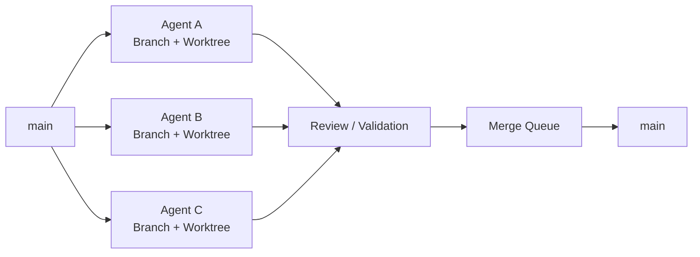
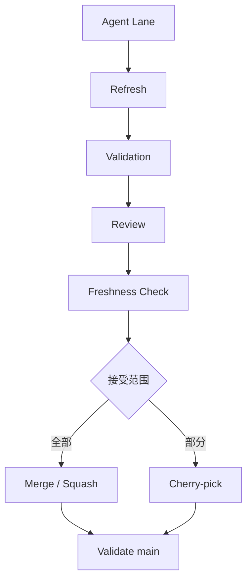
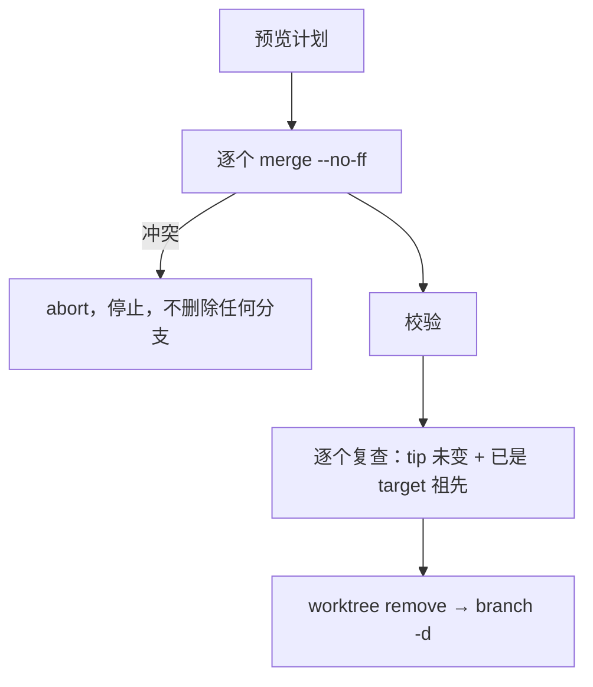
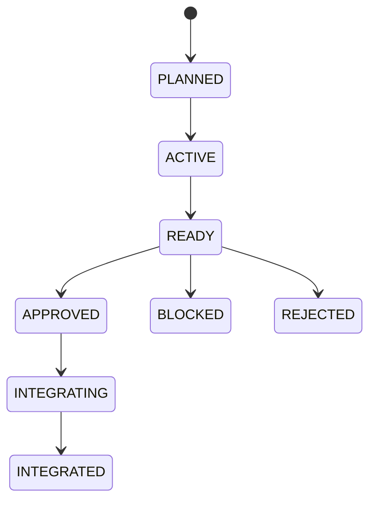

# Multi-Agent Git Orchestrator Skills

[English](README.en.md) | [中文](README.md)

> **让多个 AI Agent 安全地并行开发同一个 Git 仓库。**

`Multi-Agent Git Orchestrator` 是一个面向 Claude Code、Codex、Cursor、OpenCode 等 Coding Agent 的 Git Workflow Skill。

它会主动调查当前仓库的 **Branch / Worktree / Commit / Ahead-Behind / Dependency** 状态，并帮助 Agent 决定：

- 哪些任务可以并行
- 哪些 Worktree 可以复用
- 哪些 Branch 应该 Rebase / Merge
- 哪些 Commit 适合 Cherry-pick
- 哪些分支已经可以安全清理
- 如何避免多个 Agent 同时破坏 `main`


---

## 先用人话说明白（新手请先看这里）

> 完全没学过 Git 也没关系。下面用“几个人同时修改一份文稿”来打比方，把要用到的词讲清楚。

| 你会看到的词 | 用人话说 | 办公室比喻 |
|---|---|---|
| 仓库（repository） | 存放整个项目和它全部历史记录的文件夹 | 一个装满文稿和修订记录的档案柜 |
| 提交（commit） | 一次被记录下来的修改，带一个编号 | 文稿的一次“存档版本” |
| 分支（branch） | 一条独立的修改线路，各条线路互不干扰 | 每个人手里各自的“修订稿” |
| `main` | 通常是“正式稳定版”那条线路 | 已经定稿、对外发布的版本 |
| 合并（merge） | 把一条分支上的修改并进另一条分支 | 把几份修订稿汇总进总稿 |
| 工作区（worktree） | 某条分支正在被修改的那个文件夹 | 每个人各自的办公桌 |
| 远端（remote） | 放在网上（比如 GitHub）的那份仓库 | 公司共享网盘上的备份 |
| 预览 / 执行 | 先只看“打算怎么做”，满意了再真正去做 | 先看装修方案，点头之后才开工 |

**这套命令有一个统一的约定：默认只看、不动手。** 会真正改动仓库的三个命令（`/GitIntegrate`、`/GitCleanup`、`/GitConverge`）必须由你明确下令才会动手；只要遇到没把握的情况，它们会停下来告诉你原因，而不是硬做。

### 命令怎么写？

在 Claude Code 里直接输入命令，后面可以跟“参数”，参数之间用空格隔开：

```text
/命令名  必填的内容  --开关  --带内容的开关 内容
```

- `<尖括号>` 里的是**必填**内容，要换成你自己的，例如 `<分支名>` 换成 `agent/release`。
- `[方括号]` 里的是**可选**内容，可以不写。
- 以 `--` 开头的叫“开关”。有的单独写就生效（例如 `--apply`），有的后面要跟一个值（例如 `--lang English`）。
- 值里面有空格时，要用英文引号括起来，例如 `--lang "Brazilian Portuguese"`。
- 开关的先后顺序无所谓：`/GitConverge agent/release --apply --lang English` 和 `/GitConverge --lang English agent/release --apply` 是一样的。
- 输入 `--help` 随时可以看说明，它**只显示说明，不会查看或改动你的仓库**。

---

## 三个通用参数

下面三个参数，在支持它们的命令里写法和意思都一样。先把它们弄懂，后面每个命令就都好理解了。

### `--help`：只看说明书

**写法**：`/命令名 --help`。放在命令后面的任何位置都行，也可以和别的参数写在一起；只要出现了 `--help`，就只显示说明。

```text
/GitConverge --help
/GitIntegrate agent/auth --strategy squash --help      ← 前面写了别的参数也没关系，只会显示说明
/GitRecon --help --lang English                         ← 用英文显示说明
```

| 项目 | 说明 |
|---|---|
| 它会做什么 | 显示：这个命令怎么写、每个参数是什么意思、不写参数时的默认行为、几个例子；然后立刻停止 |
| 它不会做什么 | 不读取你的仓库、不运行任何 Git 命令、不改动任何东西 |
| 什么时候用 | 忘了怎么写；不确定某个参数的意思；第一次用某个命令 |
| 哪些命令有 | 六个命令都有 |

> 记住：**拿不准的时候，先在命令后面加 `--help`，它是完全安全的。**

---

### `--remote`：先联网问一下最新情况

**写法**：`/命令名 --remote`，只是一个开关，后面不跟任何值。

```text
/GitRecon --remote
/GitAnalyze agent/auth --remote
/GitRecommend 哪些分支应该先合并 --remote
```

**不加和加上，区别在哪？** 举个例子：昨天你的电脑记下了“网上的 `main` 在第 100 号修改”，今天同事又上传了 3 个新修改。

| 写法 | 它是怎么判断的 | 可能的后果 |
|---|---|---|
| 不加 `--remote`（默认） | 只看你电脑里**已有**的记录，也就是“网上的 `main` 在第 100 号” | 速度快、不需要网络，但结论可能已经过时 |
| 加了 `--remote` | 先联网更新记录，知道“网上的 `main` 现在在第 103 号”，再给结论 | 结论更新，但需要网络，慢一点 |

**它具体做了什么？** 等同于让 Git 更新“远端分支的清单和它们的最新位置”，并清掉网上早已删除的分支留在你电脑里的旧记录。
**它不会做什么**：不会把网上的修改合并进你的分支，不会改动你本地的任何分支和文件，也不会上传任何东西。

| 项目 | 说明 |
|---|---|
| 哪些命令有 | 只有三个“只看”的命令：`/GitRecon`、`/GitAnalyze`、`/GitRecommend`。写在别的命令后面会被当成“不认识的参数”，它会提示并显示说明 |
| 没有网络、或没有访问权限 | 它会说明联网失败，并注明“这次的结论只基于电脑里已有的记录” |
| 什么时候该加 | 你刚听说同事上传了新东西；或者你要依据“网上现在的样子”做决定 |

---

### `--lang <语言>`：让它用哪种语言回答你

**写法**：`--lang 语言`。`--lang` 后面**必须**跟一个语言，中间用空格隔开。

```text
/GitRecon --lang English
/GitAnalyze agent/auth --lang 日本語
/GitConverge agent/release --lang "Brazilian Portuguese"
/GitRecommend 哪些分支应该先合并 --lang en
```

**能写哪些语言？** 写名字或常见代码都可以，模型会写的语言基本都行：

| 想要的语言 | 可以这样写 |
|---|---|
| 中文 | `中文`、`简体中文`、`zh`（也是不写时的默认值） |
| 英文 | `English`、`en` |
| 日文 | `日本語`、`ja` |
| 韩文 | `한국어`、`ko` |
| 法文 / 德文 / 西班牙文 | `Français` / `fr`、`Deutsch` / `de`、`Español` / `es` |
| 名字里有空格的 | 要加英文引号：`"Brazilian Portuguese"` |

**它控制什么？** 它回复你的一切文字：说明、检查报告、向你提的问题、出错提示，以及 `--help` 的说明。

**哪些东西不会被翻译？** 命令名、参数名、分支名、文件路径、提交编号、Git 命令，以及 `BLOCKED_DIRTY`、`MERGE` 这样的状态代码。因为你可能要原样复制它们去运行或搜索。它可能会在旁边用你选的语言加一句白话解释，例如英文回复里写成 `BLOCKED_DIRTY` (unsaved edits in its worktree)。

| 项目 | 说明 |
|---|---|
| 不写会怎样 | **用中文回复**。即使你是用英文提问的，也是中文 |
| 放在哪里 | 命令后面的任何位置。`/GitRecommend 哪些分支应该先合并 --lang English` 里，`--lang English` 会被先摘掉，你的问题就是“哪些分支应该先合并” |
| 写错了会怎样 | `--lang` 后面什么都没写，或写的不是一种语言（比如 `--lang xyz123`），它会用中文告诉你哪里不对并显示用法，**不会继续执行命令** |
| 会影响检查结果吗 | 不会。只换回复的语言，检查和判断的方式完全一样 |
| 哪些命令有 | 六个命令都有 |

---

## Why?

多 Agent 开发很容易变成：

```text
Agent A ─┐
Agent B ─┼── 同一个目录 ── 冲突 / 覆盖 / 历史混乱
Agent C ─┘
```

本 Skill 将其变成：



核心原则：

> **One Agent Lane = One Branch + One Worktree**

---

## 核心能力

| 能力 | 说明 |
|---|---|
| Repository Recon | 主动调查 Branch / Worktree / HEAD / Dirty / Ahead-Behind |
| Dependency DAG | 判断 Agent 任务之间的依赖关系 |
| Worktree Isolation | 避免多个 Agent 修改同一个 Checkout |
| Rewrite Safety | 判断什么时候可以 Rebase，什么时候禁止重写历史 |
| Selective Integration | Merge / Squash / Cherry-pick 按实际情况选择 |
| Freshness Gate | 防止 Review 后 `main` 已变化却继续错误集成 |
| Merge Queue | 串行写入共享集成分支 |
| Safe Cleanup | 安全识别已完成 Branch / Worktree |
| Safe Rollback | 私有历史用 Reset，共享历史优先 Revert |

---

## 六个核心命令

| 命令 | 一句话 | 会改动你的仓库吗？ |
|---|---|---|
| `/GitRecon` | 给整个仓库做一次“体检” | 不会，只看 |
| `/GitAnalyze` | 深入检查某一条分支 / 工作区 | 不会，只看 |
| `/GitRecommend` | 根据真实情况，建议下一步怎么做 | 不会，只给建议 |
| `/GitIntegrate` | 把某个 AI 的成果安全地并进主线 | 会，但要先过一连串检查 |
| `/GitCleanup` | 清理已经完成的旧分支和工作区 | 默认不会；加 `--apply` 才会 |
| `/GitConverge` | 把所有分支的成果汇总到一条分支，只留 `main` 和它 | 默认不会；加 `--apply` 才会 |

每个命令都可以加 `--lang <语言>`（回复语言，不写就是中文）和 `--help`（只看说明）；三个只看的命令还有 `--remote`。它们的详细用法见上面的“三个通用参数”，下面每个命令只写它**自己独有**的参数。

> **不知道自己有哪些分支和工作区？** 先运行 `/GitRecon`，它会把清单列给你。也可以在终端里运行 `git branch`（列出分支）和 `git worktree list`（列出工作区）。

---

### `/GitRecon`

**给整个仓库做一次“体检”，只看不改。**

适合：刚接手一个项目、有好几个 AI 同时在改代码、不知道现在到底有哪些分支和工作区的时候。

```text
/GitRecon
/GitRecon --remote
/GitRecon --lang English
```

它会调查：

```text
工作区（Worktrees）         有几个，各自在哪条分支上
分支（Branches）            各自的最新位置、有没有对应的网上分支
当前位置（HEAD）            现在停在哪里
没保存的修改（Dirty）       哪些工作区里有改了一半的文件
领先 / 落后（Ahead/Behind） 和主线相比，多了几次修改、少了几次修改
游离（Detached）            哪些工作区没挂在任何分支上
网上记录（Remote tracking） 本地分支对应哪条远端分支
已合并（Merge candidates）  哪些分支的内容早就进了主线
风险（Risk）                需要你留意的地方
```

#### 参数详解

`/GitRecon` 没有必填参数，直接输入就能用。可以加的参数：

| 参数 | 写法 | 作用 |
|---|---|---|
| `--remote` | `/GitRecon --remote` | 先联网更新“远端最新记录”再体检，详见上面的“三个通用参数” |
| `--lang <语言>` | `/GitRecon --lang English` | 用指定语言回复，不写则是中文 |
| `--help` | `/GitRecon --help` | 只显示说明 |

---

### `/GitAnalyze`

**深入检查某一条分支或某一个工作区，只看不改。**

适合：你想知道“这条分支现在能不能合并、能不能删”。

```text
/GitAnalyze agent/auth
/GitAnalyze ../wt-auth --remote
```

#### 参数详解

**`<分支名或工作区路径>`（必填）：要检查的对象**

| 项目 | 说明 |
|---|---|
| 写什么 | 两种都可以：**分支名**（终端里 `git branch` 能看到的名字，例如 `agent/auth`），或**工作区的文件夹路径**（例如 `../wt-auth`，也可以写完整路径） |
| 去哪找名字 | 运行 `/GitRecon`，清单里就有所有分支名和工作区路径 |
| 不写会怎样 | 它不会猜，会问你要检查哪一个，同时显示说明 |
| 写错了会怎样 | 提示找不到这个分支或路径，并让你再确认；不会去检查别的对象 |
| 分支名和路径重名 | 它会根据仓库的实际情况判断；如果判断结果会改变结论，它会把歧义告诉你，而不是随便选一个 |

**`--remote`（可选）**：先联网更新“远端最新记录”再分析，详见“三个通用参数”。**`--lang <语言>`（可选）**：回复语言，默认中文。

#### 它会检查什么、怎么看报告

它会找出：这条分支和主线的共同起点、领先落后多少、它独有的修改、改了哪些文件、有没有别的分支依赖它、能不能改写它的历史；最后分别给出 merge、rebase、cherry-pick、压缩（squash）、清理删除这几种操作“安不安全”的结论。示例：

```text
agent/auth

Ahead:     3          ← 比主线多了 3 次修改
Behind:    2          ← 比主线少了 2 次修改（主线上有它还没拿到的新修改）
State:     DIVERGED   ← 双方都有对方没有的修改，已经“分叉”
Depends:   agent/core ← 它建立在 agent/core 的基础上
Rewrite:   FROZEN     ← 不能随便改写它的历史，否则会牵连依赖它的分支

建议：
不要直接 rebase（重写历史）
先把主线同步进来，再重新验证
```

---

### `/GitRecommend`

**根据仓库的真实状态，给出下一步怎么做的建议，只给建议、不动手。**

适合：你拿不准下一步该怎么安排，比如“3 个 AI 该怎么分工”。

```text
/GitRecommend
/GitRecommend 下一步怎么安排 3 个 Agent
/GitRecommend 哪些分支应该先合并 --remote
```

#### 参数详解

**`[你想问的事]`（可选）：你的问题或想达到的目标**

| 项目 | 说明 |
|---|---|
| 怎么写 | 直接用自己的话写在命令后面，**不用加引号**，写多长都行 |
| 不写会怎样 | 它给出一份通用的“下一步建议”，覆盖当前所有分支和工作区 |
| 怎么写才好 | **越具体越好**：说清楚你想达成什么、有几个 AI、哪些分支最要紧 |
| 和其他参数混写 | 可以。`--remote`、`--lang English` 会先被摘出来，剩下的文字才是你的问题 |

写法对比：

```text
/GitRecommend                                          ← 通用建议
/GitRecommend 下一步怎么安排 3 个 Agent                ← 分工建议
/GitRecommend agent/auth 做完了，接下来该怎么收尾      ← 针对某条分支
/GitRecommend 给新任务找最合适的工作区 --lang English   ← 英文回复
```

**`--remote`（可选）**：先联网更新“远端最新记录”。**`--lang <语言>`（可选）**：回复语言，默认中文。

#### 报告长什么样

它会先调查，再按这个结构回答：观察到的事实、最大的风险、按顺序排好的建议、每条建议的理由、以及没法确定的事项。示例：

```text
Agent A → 可以继续并行
Agent B → 和 A 改的文件高度重叠，建议排队，等 A 做完
Agent C → 依赖 A，等待 A 完成

agent/old-ui → 看起来可以清理
agent/auth   → 别人依赖它，暂时不能改写
```

---

### `/GitIntegrate`

**把某个 AI（某条“工作线”）的成果，安全地并进主线。**

适合：某个 AI 说“我做完了”，你想把它的成果正式收进来。**它不会因为 AI 说一句“Done”就动手。**

```text
/GitIntegrate agent/auth
/GitIntegrate agent/auth --strategy squash
/GitIntegrate agent/auth --strategy cherry-pick --lang English
```

#### 参数详解

**`<工作线或分支名>`（必填）：要并入主线的那条分支**

| 项目 | 说明 |
|---|---|
| 写什么 | 分支名，例如 `agent/auth`（用 `/GitRecon` 能看到全部分支名） |
| 不写会怎样 | 它会问你要集成哪一条，**不会自己挑一条** |
| 并到哪里 | 并进仓库的“集成分支”，通常是 `main`；它会根据仓库的实际约定判断，判断不了就如实告诉你，不会猜 |

**`--strategy <方式>`（可选）：用哪种方式并入**

写法：`--strategy` 后面跟下面四个值之一。不写等同于 `--strategy auto`。

| 值 | 白话意思 | 适合什么情况 |
|---|---|---|
| `auto`（默认） | 让它根据仓库的习惯和你的审核结果，自己选最合适的方式 | 不确定选哪个时 |
| `merge` | 整体并入，并且**保留**对方每一次修改的记录，再多加一条“合并记录” | 想保留完整的修改过程 |
| `squash` | 整体并入，但把对方的所有修改**压成一条**记录（仓库的规则允许时才行） | 对方的修改很零碎，想让主线保持整洁 |
| `cherry-pick` | **只挑**已经确认没问题的那几条修改并入，其余不要 | 对方的成果只有一部分可以接受 |

三种方式在“修改记录”上的区别（`A、B` 是主线原来的记录，`C、D` 是这条分支的两次修改）：

```text
merge          A──B──────M       M 是新增的合并记录，C、D 的记录原样保留
                  \     /
                   C──D

squash         A──B──S           S 是一条新记录，里面包含 C 和 D 的全部修改；C、D 不单独进入主线

cherry-pick    A──B──C'          只把 C 复制过来；D 没有进入主线
```

| 如果… | 它会… |
|---|---|
| 值写错了，例如 `--strategy rebase` | 说明只支持 `auto`、`merge`、`squash`、`cherry-pick`，显示说明，**不继续执行** |
| 写了 `--strategy` 却没写值 | 同上，让你补上 |
| 选了 `cherry-pick`，但不知道你确认了哪几条 | **停下来问你**，需要你说明哪些修改已经审核通过，它不会替你猜 |
| 你指定的方式违反仓库规则或不安全 | 拒绝并说明原因，即使你明确指定了也一样 |

**`--lang <语言>`（可选）**：回复语言，默认中文。

#### 动手之前它会检查什么

逐项检查：有没有审核通过的依据、有没有依赖没完成的部分、主线在你审核之后有没有变过、这条分支在你审核之后有没有新修改、仓库规则是否允许。**任何一项没过就停下来告诉你，不会硬来。** 并入之后，它还会重新验证主线。



---

### `/GitCleanup`

**找出可以安全清理的旧分支和工作区。**

适合：项目里积了一堆已经做完的分支，想整理一下，又怕删错。

```text
/GitCleanup              ← 只列出清单，什么都不删
/GitCleanup --apply      ← 真的去删
/GitCleanup --lang English
```

#### 参数详解

`/GitCleanup` 没有必填参数。

**`--apply`（可选）：真正动手清理**

| 项目 | 说明 |
|---|---|
| 写法 | `/GitCleanup --apply`，只是一个开关，后面不跟值 |
| 不写会怎样 | **只预览**：列出“可清理的对象”和“不能清理的对象及原因”，什么都不删 |
| 写了之后做什么 | 对清单里“可清理”的对象，**逐个再检查一遍现状**，仍然安全才删：先移除它的工作区，再删除分支 |
| 预览和执行之间有对象变了 | 比如那条分支在预览之后又有了新修改：它会**跳过**这一个并告诉你，不会照着旧清单硬删 |
| 它绝对不会做 | 强制删除；清理有未保存修改的工作区；删除含有“别处找不到的成果”的分支；也不会删除网上（远端）的分支，除非你明确要求 |

建议的用法：**先不加 `--apply` 看清单，满意了再加。**

**`--lang <语言>`（可选）**：回复语言，默认中文。

#### 预览里每个对象的状态

| 状态 | 白话意思 | 会被清理吗 |
|---|---|---|
| `SAFE_CANDIDATE` | 五个条件全满足，可以安全清理 | 加 `--apply` 才会 |
| `BLOCKED_DIRTY` | 它的工作区里有没保存的修改 | 不会 |
| `BLOCKED_UNIQUE_WORK` | 它上面有只存在于这里、别处找不到的成果 | 不会 |
| `BLOCKED_ACTIVE_OWNER` | 现在有人（或某个 AI）正在使用它 | 不会 |
| `BLOCKED_DEPENDENCY` | 别的分支依赖它 | 不会 |
| `BLOCKED_NOT_INTEGRATED` | 它的内容还没完整并入主线 | 不会 |
| `UNKNOWN` | 有关键信息没查清楚 | 不会（没把握就不动） |

一个分支要同时满足下面五条，才会成为 `SAFE_CANDIDATE`：

```text
✓ 内容已经完整并入主线
✓ 它的工作区里没有未保存的修改
✓ 现在没有人在使用它
✓ 没有别的分支依赖它
✓ 没有只存在于它上面、别处找不到的成果
```

**注意：一条分支“很久没动”并不代表可以删**，它不会只因为“旧”就把分支列入清理清单。

---

### `/GitConverge`

**把仓库里所有分支的成果汇总进你指定的一条分支，然后只留下 `main` 和这一条分支。**

适合：几个 AI 各自开了一堆分支干完活，你想“收网”——把所有人的成果集中到一处，再把用完的分支清掉。

#### 先看一个例子

假设仓库里现在有这些分支：

```text
main           正式稳定版（有 1 处新修改）
agent/release  你想把所有成果汇总到这里
agent/a        小明做了 2 处修改
agent/b        小红做了 1 处修改（她的工作区在 ../wt-b，没有没保存的东西）
agent/c        内容早就被包含了，没有新东西
```

执行 `/GitConverge agent/release --apply` 之后：

```text
之前：  main  agent/release  agent/a  agent/b  agent/c      （5 条分支）
之后：  main  agent/release                                  （2 条分支）
        └─ agent/release 里已经有了 main、a、b 的全部成果
        └─ a、b、c 被删除，小红的工作区 ../wt-b 也一并清理
```

#### 开始之前：先确认三件事

1. **你要在“放着目标分支的那个文件夹”里运行它。** 目标分支（比如 `agent/release`）当前在哪个文件夹里被使用，就在那个文件夹里打开 Claude Code。如果目标分支正被另一个文件夹使用，它会拒绝并告诉你“请去那个文件夹运行”。
2. **这个文件夹里不能有没保存的修改，也不能处于“做到一半”的状态**（比如正在合并、正在改写历史）。否则它会拒绝并说明原因。
3. **目标分支不能是 `main`。** 要往 `main` 里合并成果，请用 `/GitIntegrate`。

#### 用法：三步走

**第 1 步：先预览（什么都不会改）**

```text
/GitConverge agent/release
```

它会列出一份“计划”：先合并哪些分支、按什么顺序、哪些分支会被删、哪些分支因为什么原因会被**保留**、最后会剩下哪些分支。示意：

```text
计划（这是预览，没有改动任何东西）
目标分支：agent/release

将要合并（按这个顺序）
  1. main        1 处新修改
  2. agent/a     2 处新修改
  3. agent/b     1 处新修改（工作区 ../wt-b 干净，合并后删除）
已经包含、只需删除：agent/c

被保留的分支：无
执行后只剩：main、agent/release
不会动：网上的分支、标签、别人正在用的工作区
```

**第 2 步：看懂计划**

预览里每个分支后面会有一个“状态”。下面是白话翻译：

| 状态 | 白话意思 | 会合并吗 | 会删除吗 |
|---|---|---|---|
| `MERGE` | 有新修改，要并进目标分支 | 会 | 合并后删除 |
| `CONTAINED` | 它的修改早就在目标分支里了 | 不用 | 删除 |
| `BLOCKED_UNRELATED_HISTORY` | 和目标分支毫无关系（比如单独放网页的 `gh-pages`） | 不会 | 保留 |
| `BLOCKED_IN_PROGRESS` | 有人正做到一半（改写历史、挑拣修改等），它的位置不可靠 | 不会 | 保留 |
| `BLOCKED_DIRTY` | 它的工作区里有没保存的修改 | 会（只合并已保存的部分） | 保留 |
| `BLOCKED_LOCKED` | 它的工作区被锁住了（有人或程序在用） | 会 | 保留 |
| `BLOCKED_ACTIVE_OWNER` | 工作区属于别的 AI / 工具，或是主工作区 | 会 | 保留 |
| `BLOCKED_IGNORED_FILES` | 工作区里有被 Git 忽略的文件（比如存放密码的 `.env`） | 会 | 保留（加 `--discard-ignored` 才删） |
| `BLOCKED_SUBMODULE` | 工作区带“子项目”，Git 不允许直接删除 | 会 | 保留 |
| `BLOCKED_UPSTREAM_OF_KEPT` | 另一条被保留的分支依赖它 | 会 | 保留 |
| `UNKNOWN` | 有关键信息没查清楚 | 不动 | 不动 |

只要有分支被保留，计划里会明确告诉你：“最后不会只剩 `main` 和目标分支”，并写清楚原因和下一步该做什么。

**第 3 步：满意了，再执行**

```text
/GitConverge agent/release --apply
```

它会重新检查一遍现状，把这次要做的计划记下来，按计划逐个合并，然后删除已经合并的分支和它们干净的工作区，最后给你一份报告。报告里有：它依据的计划、做了什么、跳过了什么（和原因）、目标分支的起点和终点编号、每个被删分支原来的编号。

#### 参数详解

**`<分支名>`（必填）：所有成果汇总到哪条分支**

| 项目 | 说明 |
|---|---|
| 写什么 | 一条**本地**分支的名字，例如 `agent/release`。用 `/GitRecon` 或终端的 `git branch` 能看到名字 |
| 要写得**完全一样** | **区分大小写**。`agent/release` 对，`Agent/Release` 不对：它会拒绝，并提示你正确的名字 |
| 不能写什么 | `main`（它永远不会被移动）；不存在的分支；网上的分支名（如 `origin/xxx`）；文件夹路径 |
| 不写会怎样 | 它会问你，并显示说明 |
| 提醒 | 目标分支必须是一条现有的本地分支，它不会替你新建 |

**`--apply`（可选）：真正去合并和删除**

| 项目 | 说明 |
|---|---|
| 写法 | `/GitConverge agent/release --apply`，只是一个开关，后面不跟值 |
| 不写会怎样 | **只预览**，什么都不改。这也是默认行为 |
| 写了之后做什么 | 重新检查现状 → 记下计划 → 先切换到目标分支（如果当前不在上面） → 按顺序逐个合并 → 校验 → 逐个再确认后删除 → 出报告 |
| 合并顺序 | `main` 最先；其余的按“新修改多的优先”，同样多的按名字排序。这样如果甲包含乙，合到甲时乙就已经被带进来了，不会重复合并 |
| 遇到冲突 | 立刻撤销这一次合并，**整体停下，什么都不删**；已经成功的合并保留 |
| 删除之前 | 每个分支都会再确认：没有新修改、内容确实已经在目标分支里、它的工作区仍然干净 |
| 之前预览过 | 如果你在同一次对话里先预览过，执行时会和那次预览对比：只要有分支的位置变了，就停下来重新给你预览；预览之后新出现的分支或工作区一律不碰 |

**`--discard-ignored`（可选）：允许清理含“被忽略文件”的工作区**

什么是“被忽略文件”？有些文件（比如存放密码和密钥的 `.env`、临时文件夹 `node_modules/`）不会被 Git 记录，所以**一旦删掉就找不回来**。

| 项目 | 说明 |
|---|---|
| 写法 | `/GitConverge agent/release --apply --discard-ignored`，开关，不跟值 |
| 不写会怎样 | 工作区里只要有被忽略文件，这个工作区和它的分支就**被保留**（状态是 `BLOCKED_IGNORED_FILES`），预览里会把这些文件逐个列给你 |
| 写了之后 | 这样的工作区会被清理，**里面被忽略的文件会随之永久消失** |
| 单独写有用吗 | 没有。它只在写了 `--apply` 时才有意义 |
| 什么时候该写 | 你看过预览里列出的被忽略文件，确认都不需要了（比如只是可以重新生成的临时文件） |

> 它**永远不会**覆盖你当前文件夹里已有的被忽略文件：如果某个分支带来的文件会覆盖它们，整个命令会在合并之前停下并告诉你，这和 `--discard-ignored` 无关。

**`--lang <语言>`（可选）**：回复语言，默认中文。**`--help`（可选）**：只显示说明。

示例：

```text
/GitConverge agent/release                              只看计划
/GitConverge agent/release --apply                      照计划执行
/GitConverge agent/release --apply --lang English       照计划执行，用英文回复
/GitConverge agent/release --apply --discard-ignored    连带清理含 .env 的工作区
```

#### 它会拒绝执行的几种情况

下面这些情况，它会**在动手之前**就停下并说明原因，对仓库不做任何改动：

| 情况 | 它会怎么说 | 你该怎么办 |
|---|---|---|
| 目标分支不存在，或大小写不对 | 找不到这个分支；如果只是大小写不同，会告诉你正确的名字 | 改成正确的名字 |
| 目标分支是 `main` | `main` 不能当目标 | 改用 `/GitIntegrate`，或换一条分支 |
| 本地没有 `main` 分支 | 缺少 `main` | 先在仓库里建好 `main` |
| 目标分支正被别的文件夹使用 | 请去那个文件夹运行 | 到它指出的文件夹里重新运行 |
| 当前文件夹有没保存的修改、没挂在分支上、或做到一半 | 当前文件夹不安全 | 先保存或处理好，再重新运行 |
| 目标分支或 `main` 只存在于一个已被删掉的文件夹的记录里 | 记录残缺，没法切换 | 按提示清理那条残缺记录后再运行 |

#### 它一定遵守的规则

```text
✓ 默认只预览。不加 --apply 就不会改动任何东西
✓ main 只被“读取”：不会被移动、重置或删除
✓ 网上的分支、标签、没挂在分支上的工作区，一律不碰；也不会替你上传到网上
✓ 遇到合并冲突就立刻撤销这一次合并并停下，不会删除任何分支；已经完成的合并保留
✓ 有没保存修改、被锁住、做到一半、属于别人的工作区：保留它和它的分支
✓ 绝不覆盖你电脑里被忽略的文件（如 .env）；含这类文件的工作区默认保留
✓ 不用“强制删除”，不用“强制清理工作区”，不做全仓库的“清理悬空记录”
✓ 删每一个分支之前再确认一遍：它没变过、内容确实已在目标分支里
```

#### 出了意外怎么办

- **提示“合并冲突”**：意思是两条分支改了同一个地方、改法还不一样，机器没法替你选。它会把这次合并撤销、停下，**什么都不会删**，并告诉你是哪条分支冲突。你处理完（或者删掉不要的那条分支）再重新执行一遍，已经合并成功的分支会被当作“已包含”，只做删除。
- **想找回被删掉的分支**：报告里有每个被删分支原来的编号（一串字母数字，比如 `8eccc62`）。拿着编号可以随时恢复：

  ```text
  git branch agent/a 8eccc62
  ```

- **想整体撤销这次汇总**：报告里有目标分支的“起点编号”。有 Git 基础的人可以把目标分支改回起点；没基础的话，把这份报告发给懂 Git 的同事或 AI，让他们来处理。
- **不确定该不该动手**：永远可以先不加 `--apply`，只看计划。

#### 常见疑问

- **会不会删掉我还没保存的修改？** 不会。有没保存修改的工作区会连同它的分支一起被保留。
- **会影响 GitHub 上的分支吗？** 不会。它不上传、不删除任何网上的东西。汇总完之后要不要上传，由你自己决定。
- **为什么有些分支没被删？** 看计划里的“状态”表，每一个被保留的分支都写了原因和下一步该做什么。
- **执行到一半断了怎么办？** 重新执行同一条命令即可。它每次都会先重新检查现状，已经合并过的分支只会被删除，不会重复合并。
- **我想让回复是英文？** 在命令最后加 `--lang English`。



---

## 多 Agent 生命周期



每条 Agent Lane 都记录：

```text
Task
Owner
Branch
Worktree
Base Branch
Base SHA
Current HEAD
Dependencies
Validation Evidence
Integration Decision
```

---

## Git 操作决策

```text
整个 Agent 成果都要
        ↓
      Merge

只要部分 Commit
        ↓
   Cherry-pick

Agent 私有分支落后 main
        ↓
  Rewrite-safe?
    ↓       ↓
   YES      NO
 Rebase    Merge target into lane

私有历史走错
        ↓
      Reset

已经进入共享历史后出错
        ↓
      Revert
```

---

## 安全原则

```text
Observe first.
Advise second.
Mutate only when needed.
```

本 Skill 默认禁止：

- 多个 Agent 同时修改同一个 Checkout
- 未调查仓库就给出具体 Branch / Worktree 建议
- 随意 Rebase 已被其他 Agent 依赖的 Branch
- 对共享历史执行 destructive reset
- 默认 Force Push
- 未检查依赖就 Cherry-pick
- Review 已过期仍然继续 Integration
- 仅因为 Branch 很旧就判断可以删除

---

## 安装

将目录放入支持 Agent Skills 的 Skills 路径：

```text
multi-agent-git-orchestrator/
├── SKILL.md
├── plugin.json                # Agent Plugins 清单：把整个仓库当作一个插件导入时使用
├── commands/                  # Claude Code command prompts
├── skills/                    # Codex / Hermes command adapters
└── references/
    ├── commands.md
    ├── reconnaissance.md
    ├── decision-matrix.md
    ├── handoff-and-state.md
    ├── design-rationale.md
    └── pressure-tests.md
```

Skill 可以通过语义自动触发。

### Claude Code：启用 Slash Command

Claude Code 只会为每个 Skill 注册**一个**以 Skill 名命名的斜杠命令，`/GitRecon` 等六个命令需要额外安装 `commands/` 下的命令文件：

```text
commands/
├── GitRecon.md
├── GitAnalyze.md
├── GitRecommend.md
├── GitIntegrate.md
├── GitCleanup.md
└── GitConverge.md
```

在本仓库根目录执行，复制到用户级命令目录（所有项目可用）；也可以复制到某个项目的 `.claude/commands/`（仅该项目可用）。注意不要放进 Skill 目录内部，那里的文件不会被识别为命令：

```bash
mkdir -p ~/.claude/commands && cp commands/Git*.md ~/.claude/commands/
```

```powershell
New-Item -ItemType Directory -Force "$HOME\.claude\commands"; Copy-Item commands\Git*.md "$HOME\.claude\commands\"
```

安装后**重新开启会话**，输入 `/Git` 即可看到六个命令。

也可以显式调用：

```text
/GitRecon
/GitAnalyze <branch>
/GitRecommend [goal]
/GitIntegrate <lane-or-branch>
/GitCleanup
/GitConverge <branch>
```

六个命令的跨宿主名称和说明：

| 命令 | Claude Code | Hermes | Codex | 说明 |
|---|---|---|---|---|
| GitRecon | `/GitRecon` | `/git-recon` | `$git-recon` | 检查仓库 branch / worktree 状态并生成快照 |
| GitAnalyze | `/GitAnalyze` | `/git-analyze` | `$git-analyze` | 分析指定目标的差异、依赖和操作风险 |
| GitRecommend | `/GitRecommend` | `/git-recommend` | `$git-recommend` | 根据当前状态建议 Git 与多 Agent 下一步 |
| GitIntegrate | `/GitIntegrate` | `/git-integrate` | `$git-integrate` | 通过安全门禁后集成指定 lane 或 branch |
| GitCleanup | `/GitCleanup` | `/git-cleanup` | `$git-cleanup` | 默认预览可清理项；`--apply` 才允许删除 |
| GitConverge | `/GitConverge` | `/git-converge` | `$git-converge` | 把所有本地分支合并进指定分支并只保留 `main` 和它；默认预览，`--apply` 才执行 |

斜杠入口说明：

| 宿主 | 从 `/` 进入 | 前提条件 |
|---|---|---|
| Claude Code | 直接输入 `/GitRecon` 等六个命令 | `~/.claude/commands/Git*.md` 已安装（`sync_hosts.py --host claude`），并已新开会话 |
| Hermes | 直接输入 `/git-recon` 等六个命令 | 包已安装到 `<Hermes home>/skills/`，并已新开会话或执行 `/reload-skills` |
| Codex | 输入 `/skills`，打开 Skill 列表后选择 `git-*`；也可以直接输入 `$git-recon` | 包已安装到 `~/.agents/skills/MAGOS`（`sync_hosts.py --host codex`），并已重启 Codex |

Codex 的 `/` 菜单只包含内置命令（源码 `codex-rs/tui/src/bottom_pane/command_popup.rs` 中只有 `Builtin` 与 `ServiceTier` 两类条目），无法注册自定义的 `/git-*`。因此在 Codex 中，斜杠入口是内置的 `/skills`。

### 参数提示与帮助

Claude Code 会在命令补全中显示 `commands/` 文件里的 `argument-hint`，例如 `/GitAnalyze <branch|worktree> [--remote] [--lang <language>] [--help]`。Codex 的 Skill 列表和 Hermes 的 Slash Command 说明会尽量带上简短用法；选中后可用 `--help` 查看完整参数说明和示例。`--help` 只显示说明，不检查或修改仓库。

```text
Claude Code: /GitIntegrate agent/auth --strategy squash
Hermes:      /git-integrate agent/auth --strategy squash
Codex:       $git-integrate agent/auth --strategy squash

Claude help: /GitIntegrate --help
Hermes help: /git-integrate --help
Codex help:  $git-integrate --help
```

运行源码契约检查：`python -X utf8 tests/codex/contracts/run_contract_cases.py`。每个用例的输入和结果保存在 `tests/codex/contracts/cases/<group>/<case>/evidence/`。这些检查不启动 AI 宿主；其中 `package/install-layout` 会把 Codex 与 Hermes 包安装到临时 home，确认适配层引用的每个文件都存在，并按两个宿主的发现规则（复刻版）确认每个 Skill 只被发现一次，直接 `git clone` 到 Skill 目录时也一样；`package/agent-plugin` 检查仓库是否符合 Agent Plugins 1.0.0 插件格式（见“作为 Agent Plugin 导入”）。

### Codex / Hermes 的包结构

Codex 和 Hermes 都安装同一个宿主中立的包，目录结构必须与仓库一致，`skills/git-*/SKILL.md` 才能通过 `../../SKILL.md`、`../../references/*.md` 找到共享规则：

```text
MAGOS/                       # Codex 包根；Hermes 使用 multi-agent-git-orchestrator/
├── SKILL.md                 # 根 Skill：multi-agent-git-orchestrator（语义自动触发）
├── references/*.md          # 全部参考文档
└── skills/git-*/            # 六个命令适配层
    ├── SKILL.md
    └── agents/openai.yaml   # Codex：显示说明 + allow_implicit_invocation: false
```

`commands/` 只供 Claude Code 使用，Codex / Hermes 包中不需要。`plugin.json` 也不在这个包里，它只在把整个仓库当作插件导入时使用。推荐用同步脚本安装或更新（`--create-roots` 会创建缺失的安装根目录；脚本从不删除文件）：

```bash
python -X utf8 scripts/sync_hosts.py --host codex --host hermes --apply --create-roots
python -X utf8 scripts/sync_hosts.py --host codex --host hermes --verify
```

### Codex：启用命令 Skill

Codex 的自定义入口是 Skill 选择器（`$`），不是任意命名的 `/Git...` Slash Command。Codex 递归扫描 Skill 根目录，因此会同时加载根 Skill 和 `skills/` 下的六个命令 Skill；`agents/openai.yaml` 中的简短说明会显示在 Skill 列表里。六个命令 Skill 都设置了 `policy.allow_implicit_invocation: false`，只在显式选择时运行，语义自动触发由根 Skill 负责。

用户级安装位置是 `~/.agents/skills/MAGOS`。已经安装在旧位置 `$CODEX_HOME/skills/MAGOS`（默认 `~/.codex/skills/MAGOS`）的，同步脚本会继续更新旧位置；两个位置不要同时保留，否则 Codex 会看到重复的 Skill。手动安装（Windows PowerShell）：

```powershell
$codexPackage = Join-Path $HOME ".agents\skills\MAGOS"
New-Item -ItemType Directory -Force $codexPackage | Out-Null
Copy-Item -Path .\SKILL.md, .\references, .\skills -Destination $codexPackage -Recurse -Force
```

macOS / Linux：

```bash
mkdir -p "$HOME/.agents/skills/MAGOS"
cp -R SKILL.md references skills "$HOME/.agents/skills/MAGOS/"
```

重新启动 Codex 后，输入 `$` 选择命令 Skill，或直接调用 `$git-recon`、`$git-analyze`、`$git-recommend`、`$git-integrate`、`$git-cleanup`、`$git-converge`。`/skills` 可打开 Skill 浏览入口。参数写在 Skill 名后面，例如 `$git-analyze agent/auth --remote`；加 `--help` 可查看完整参数说明。

### Hermes：启用 Slash Skill

Hermes 会把已安装的每个 Skill 自动注册成一个 Slash Command（名称取自 frontmatter 的 `name`），并将 `description` 用作命令说明。安装后会出现 `/multi-agent-git-orchestrator` 和六个 `/git-*` 命令。

Hermes 的 home 目录依次取 `HERMES_HOME`、Windows 上的 `%LOCALAPPDATA%\hermes`、其他系统上的 `~/.hermes`；如果其中的 `active_profile` 指定了非默认 profile，则改用 `profiles/<name>`。Skill 放在 home 下的 `skills/`。同步脚本按同样规则定位。如果已有 `<Hermes home>/skills/MAGOS`（例如直接 `git clone` 的安装），脚本会沿用它；如果它是 git checkout，脚本会拒绝复制文件，请改用 git 更新。手动安装（Windows PowerShell）：

```powershell
$hermesHome = if ($env:HERMES_HOME) { $env:HERMES_HOME } else { Join-Path $env:LOCALAPPDATA "hermes" }
$hermesSkills = Join-Path $hermesHome "skills\multi-agent-git-orchestrator"
New-Item -ItemType Directory -Force $hermesSkills | Out-Null
Copy-Item -Path .\SKILL.md, .\references, .\skills -Destination $hermesSkills -Recurse -Force
```

macOS / Linux：

```bash
mkdir -p "${HERMES_HOME:-$HOME/.hermes}/skills/multi-agent-git-orchestrator"
cp -R SKILL.md references skills "${HERMES_HOME:-$HOME/.hermes}/skills/multi-agent-git-orchestrator/"
```

重新启动 Hermes 后，可运行 `hermes skills list` 查看各命令说明，并调用 `/git-recon`、`/git-analyze`、`/git-recommend`、`/git-integrate`、`/git-cleanup` 或 `/git-converge`。参数直接跟在命令后面，例如 `/git-analyze main --remote`，也可用 `/git-analyze --help` 查看完整说明。Hermes 的 Skill 查看工具不接受含 `..` 的路径，适配层会改用 `[Skill directory: ...]` 给出的绝对路径读取共享文件。Hermes 没有按 Skill 关闭自动调用的开关，因此 `/git-integrate`、`/git-cleanup` 与 `/git-converge` 在适配层中规定：未经用户显式调用时不写入仓库。

如果宿主不支持自定义 Slash Command，也可以直接输入：

```text
GitRecon
GitAnalyze agent/auth
GitRecommend
```

### 作为 Agent Plugin 导入

仓库根目录的 `plugin.json` 是一份插件“说明书”，格式遵循 [Agent Plugins 1.0.0 规范](https://agent-plugins.org/specification)。支持这个规范的工具（例如 Codex 的插件安装、Hermes 的 `hermes plugins install`）可以把整个仓库当作一个名叫 `magos` 的插件导入。

导入后会是这样：

| 你关心的问题 | 答案 |
|---|---|
| 能用哪些命令？ | `skills/` 下的六个命令 Skill：`git-recon`、`git-analyze`、`git-recommend`、`git-integrate`、`git-cleanup`、`git-converge`。有的工具会加上插件名前缀，例如 Codex 显示为 `magos:git-recon`。 |
| 根目录的 `SKILL.md`（总规则）呢？ | 它不算插件 Skill，因为规范只认 `skills/` 下面的文件夹。六个命令会去读它和 `references/` 里的规则；但它不会在你描述问题时自动出现，想要自动触发，请用上面各工具的安装方式。目前验证过的只有“六个命令 Skill 能被识别并加载”，各工具里命令实际怎么运行，还没有逐一实测。 |
| Claude Code 能用吗？ | Claude Code 不读这个文件（它的插件说明书放在 `.claude-plugin/plugin.json`）。`/GitXxx` 命令请按上面 Claude Code 的方法安装。 |
| Hermes 用哪种方式？ | 请用上面的同步脚本安装。以插件方式导入的 Skill 要手动启用，不在可用 Skill 列表里，没有 `/git-*` 命令，也拿不到 `[Skill directory: …]` 这条路径提示。三个会修改仓库的命令（`git-integrate`、`git-cleanup`、`git-converge`）只认 `/git-*` 或 `$git-*` 这样的明确调用，所以在 Hermes 里不要用插件方式导入它们。 |

仓库里故意没有 `.claude-plugin/`、`.codex-plugin/` 或 `.cursor-plugin/`：把仓库 `git clone` 到 Codex 的 Skill 目录时，Codex 一看到这些文件夹，就会把 Skill 改名为 `magos:git-recon`，原来的 `$git-recon` 就叫不出来了。只有 `plugin.json` 不会这样。

一处已知的偏差：规范第 8 节要求“只给某一个工具用的文件”放进以反向域名命名的文件夹（例如 `com.example.client/`）。`commands/` 只给 Claude Code 用，却放在顶层。插件工具会直接忽略它，不影响导入；要挪动它，安装脚本和大量测试都得跟着改，所以暂时留在原处。

改版本号时，`plugin.json` 的 `version`、`SKILL.md` 的 `metadata.version` 和 `references/commands.md` 第 3 行要一起改。下面第一条命令检查插件格式（源码契约 `package/agent-plugin`），第二条故意制造各种错误（清单写错、版本号对不上、文件夹里多出链接等），确认检查真的能把它们找出来：

```bash
python -X utf8 tests/codex/contracts/run_contract_cases.py
python -X utf8 tests/codex/contracts/test_agent_plugin.py
```

---

## 适用场景

特别适合：

- Claude Code / Codex / Cursor 多 Agent 开发
- Git Worktree 并行开发
- AI 自动任务拆分
- 大量 Agent Branch 管理
- Human-in-the-loop Review
- Agent Worktree 可视化
- 自动 Merge Queue
- AI 生成代码的选择性集成

---

## Philosophy

Git 不只是版本管理工具。

在多 Agent 软件工程中，它还可以成为：

```text
Isolation Layer
+
Dependency Graph
+
Review Boundary
+
Integration Protocol
+
Rollback System
```

**让 Agent 可以大胆开发，让主分支保持可控。**

---

## License

Apache-2.0
