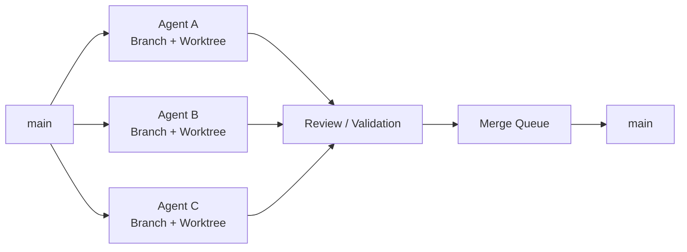
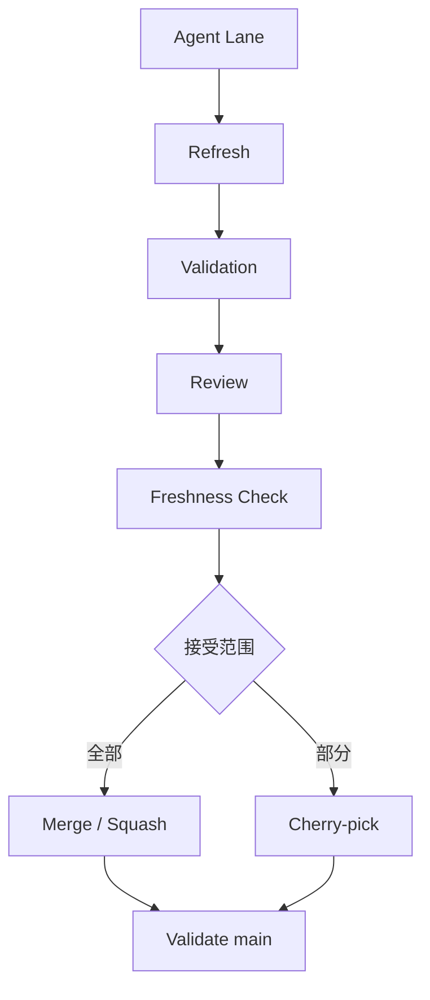
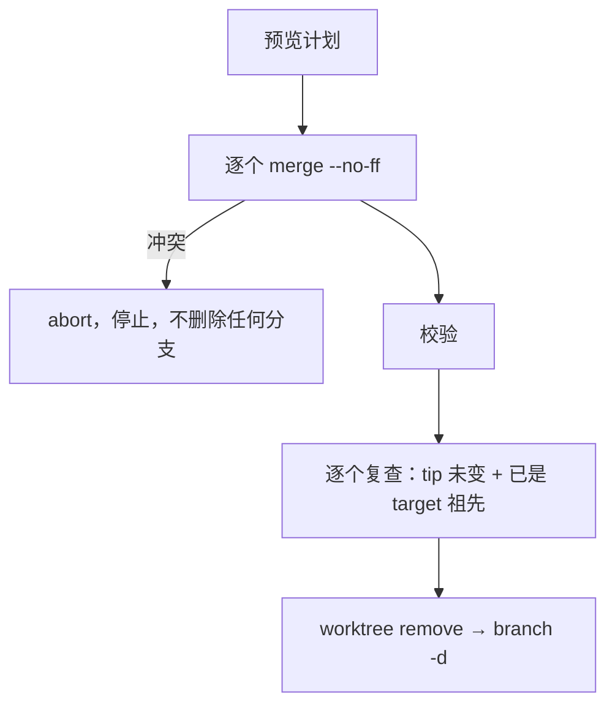
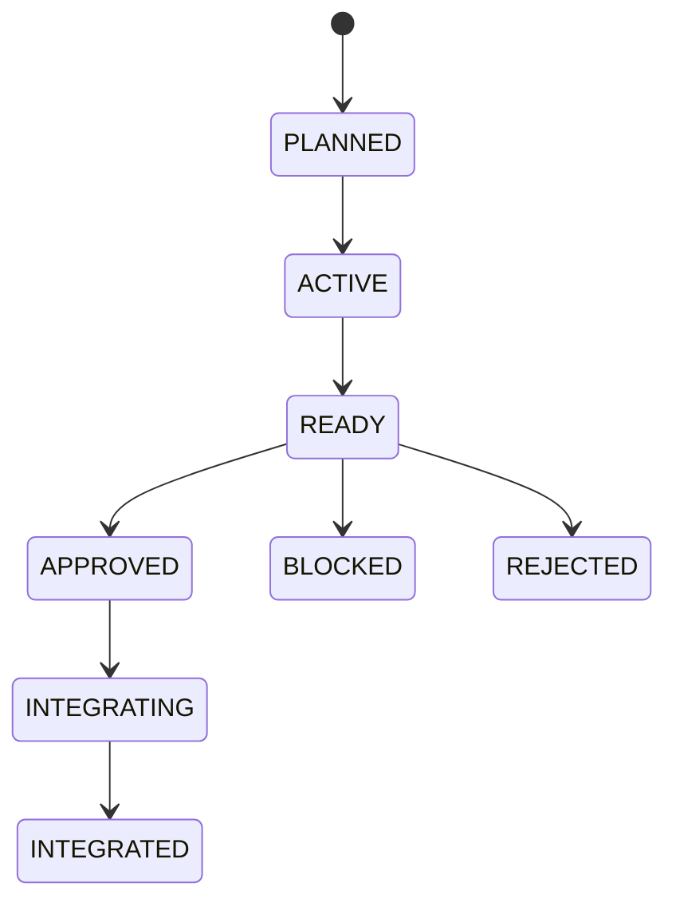

# Multi-Agent Git Orchestrator Skills

[English](README.en.md) | [中文](README.md) | [日本語](README.ja.md)

> **让多个 AI Agent 安全地并行开发同一个 Git 仓库。**

`Multi-Agent Git Orchestrator` 是一个面向 Claude Code、Codex、Cursor、OpenCode、Hermes 等 Coding Agent（以及任何支持 Agent Skills 格式的宿主）的 Git Workflow Skill。

它会主动调查当前仓库的 **Branch / Worktree / Commit / Ahead-Behind / Dependency** 状态，并帮助 Agent 决定：

- 哪些任务可以并行
- 哪些 Worktree 可以复用
- 哪些 Branch 应该 Rebase / Merge
- 哪些 Commit 适合 Cherry-pick
- 哪些分支已经可以安全清理
- 如何避免多个 Agent 同时破坏 `main`


---

## 先用人话说明白（新手请先看这里）

> 完全没学过 Git 也没关系。下面用“几个人同时修改一份文稿”来打比方，把要用到的词讲清楚。

| 你会看到的词 | 用人话说 | 办公室比喻 |
|---|---|---|
| 仓库（repository） | 存放整个项目和它全部历史记录的文件夹 | 一个装满文稿和修订记录的档案柜 |
| 提交（commit） | 一次被记录下来的修改，带一个编号 | 文稿的一次“存档版本” |
| 分支（branch） | 一条独立的修改线路，各条线路互不干扰 | 每个人手里各自的“修订稿” |
| `main` | 通常是“正式稳定版”那条线路 | 已经定稿、对外发布的版本 |
| 合并（merge） | 把一条分支上的修改并进另一条分支 | 把几份修订稿汇总进总稿 |
| 工作区（worktree） | 某条分支正在被修改的那个文件夹 | 每个人各自的办公桌 |
| 远端（remote） | 放在网上（比如 GitHub）的那份仓库 | 公司共享网盘上的备份 |
| 预览 / 执行 | 先只看“打算怎么做”，满意了再真正去做 | 先看装修方案，点头之后才开工 |

**这套命令有一个统一的约定：先看，只在你下令时才动手。** 会真正改动仓库的四个命令（`/GitIntegrate`、`/GitCleanup`、`/GitConverge`、`/GitSweep`）必须由你明确下令才会动手：`/GitCleanup`、`/GitConverge`、`/GitSweep` 默认只预览，加 `--apply` 才执行；`/GitIntegrate` 没有预览模式，输入它就是下令集成，它先逐项过检查，全部通过才写入。只要遇到没把握的情况，它们会停下来告诉你原因，而不是硬做。

### 命令怎么写？

在 Claude Code 里直接输入命令，后面可以跟“参数”，参数之间用空格隔开：

```text
/命令名  必填的内容  --开关  --带内容的开关 内容
```

- `<尖括号>` 里的是**必填**内容，要换成你自己的，例如 `<分支名>` 换成 `agent/release`。
- `[方括号]` 里的是**可选**内容，可以不写。
- 以 `--` 开头的叫“开关”。有的单独写就生效（例如 `--apply`），有的后面要跟一个值（例如 `--lang English`）。
- 值里面有空格时，要用英文引号括起来，例如 `--lang "Brazilian Portuguese"`。
- 开关的先后顺序无所谓：`/GitConverge agent/release --apply --lang English` 和 `/GitConverge --lang English agent/release --apply` 是一样的。
- 输入 `--help` 随时可以看说明，它**只显示说明，不会查看或改动你的仓库**。
- 本文统一把命令写作 `/GitRecon`。实际要输入的名字随宿主和安装方式而定：例如从插件市场安装时，Claude Code 里是 `/magos:GitRecon`，Codex 里是 `$magos:git-recon`，Hermes 里是 `/magos:git-recon`。完整对照见“安装”一节。

---

## 三个通用参数

下面三个参数，在支持它们的命令里写法和意思都一样。先把它们弄懂，后面每个命令就都好理解了。

### `--help`：只看说明书

**写法**：`/命令名 --help`。放在命令后面的任何位置都行，也可以和别的参数写在一起；只要出现了 `--help`，就只显示说明。

```text
/GitConverge --help
/GitIntegrate agent/auth --strategy squash --help      ← 前面写了别的参数也没关系，只会显示说明
/GitRecon --help --lang English                         ← 用英文显示说明
```

| 项目 | 说明 |
|---|---|
| 它会做什么 | 显示：这个命令怎么写、每个参数是什么意思、不写参数时的默认行为、几个例子；然后立刻停止 |
| 它不会做什么 | 不读取你的仓库、不运行任何 Git 命令、不改动任何东西 |
| 什么时候用 | 忘了怎么写；不确定某个参数的意思；第一次用某个命令 |
| 哪些命令有 | 七个命令都有 |

> 记住：**拿不准的时候，先在命令后面加 `--help`，它是完全安全的。**

---

### `--remote`：先联网问一下最新情况

**写法**：`/命令名 --remote`，只是一个开关，后面不跟任何值。

```text
/GitRecon --remote
/GitAnalyze agent/auth --remote
/GitRecommend 哪些分支应该先合并 --remote
```

**不加和加上，区别在哪？** 举个例子：昨天你的电脑记下了“网上的 `main` 在第 100 号修改”，今天同事又上传了 3 个新修改。

| 写法 | 它是怎么判断的 | 可能的后果 |
|---|---|---|
| 不加 `--remote`（默认） | 只看你电脑里**已有**的记录，也就是“网上的 `main` 在第 100 号” | 速度快、不需要网络，但结论可能已经过时 |
| 加了 `--remote` | 先联网更新记录，知道“网上的 `main` 现在在第 103 号”，再给结论 | 结论更新，但需要网络，慢一点 |

**它具体做了什么？** 等同于让 Git 更新“远端分支的清单和它们的最新位置”，并清掉网上早已删除的分支留在你电脑里的旧记录。
**它不会做什么**：不会把网上的修改合并进你的分支，不会改动你本地的任何分支和文件，也不会上传任何东西。

| 项目 | 说明 |
|---|---|
| 哪些命令有 | 只有三个“只看”的命令：`/GitRecon`、`/GitAnalyze`、`/GitRecommend`。`/GitSweep` 有一个同名但不同的参数 `--remote <名字>`：后面必须跟远端名，只用来指定要清理哪个远端，从不刷新记录。写在其他命令后面会被当成“不认识的参数”，它会提示并显示说明 |
| 没有网络、或没有访问权限 | 它会说明联网失败，并注明“这次的结论只基于电脑里已有的记录” |
| 什么时候该加 | 你刚听说同事上传了新东西；或者你要依据“网上现在的样子”做决定 |

---

### `--lang <语言>`：让它用哪种语言回答你

**写法**：`--lang 语言`。`--lang` 后面**必须**跟一个语言，中间用空格隔开。

```text
/GitRecon --lang English
/GitAnalyze agent/auth --lang 日本語
/GitConverge agent/release --lang "Brazilian Portuguese"
/GitRecommend 哪些分支应该先合并 --lang en
```

**能写哪些语言？** 写名字或常见代码都可以，模型会写的语言基本都行：

| 想要的语言 | 可以这样写 |
|---|---|
| 中文 | `中文`、`简体中文`、`zh`（也是不写时的默认值） |
| 英文 | `English`、`en` |
| 日文 | `日本語`、`ja` |
| 韩文 | `한국어`、`ko` |
| 法文 / 德文 / 西班牙文 | `Français` / `fr`、`Deutsch` / `de`、`Español` / `es` |
| 名字里有空格的 | 要加英文引号：`"Brazilian Portuguese"` |

**它控制什么？** 它回复你的一切文字：说明、检查报告、向你提的问题、出错提示，以及 `--help` 的说明。

**哪些东西不会被翻译？** 命令名、参数名、分支名、文件路径、提交编号、Git 命令，以及 `BLOCKED_DIRTY`、`MERGE` 这样的状态代码。因为你可能要原样复制它们去运行或搜索。它可能会在旁边用你选的语言加一句白话解释，例如英文回复里写成 `BLOCKED_DIRTY` (unsaved edits in its worktree)。

| 项目 | 说明 |
|---|---|
| 不写会怎样 | **用中文回复**。即使你是用英文提问的，也是中文 |
| 放在哪里 | 命令后面的任何位置。`/GitRecommend 哪些分支应该先合并 --lang English` 里，`--lang English` 会被先摘掉，你的问题就是“哪些分支应该先合并” |
| 写错了会怎样 | `--lang` 后面什么都没写，或写的不是一种语言（比如 `--lang xyz123`），它会用中文告诉你哪里不对并显示用法，**不会继续执行命令** |
| 会影响检查结果吗 | 不会。只换回复的语言，检查和判断的方式完全一样 |
| 哪些命令有 | 七个命令都有 |

---

## Why?

多 Agent 开发很容易变成：

```text
Agent A ─┐
Agent B ─┼── 同一个目录 ── 冲突 / 覆盖 / 历史混乱
Agent C ─┘
```

本 Skill 将其变成：


```mermaid
flowchart LR
    M["main"] --> A["Agent A<br/>Branch + Worktree"]
    M --> B["Agent B<br/>Branch + Worktree"]
    M --> C["Agent C<br/>Branch + Worktree"]

    A --> R["Review / Validation"]
    B --> R
    C --> R

    R --> Q["Merge Queue"]
    Q --> M2["main"]
```

核心原则：

> **One Agent Lane = One Branch + One Worktree**

---

## 核心能力

| 能力 | 说明 |
|---|---|
| Repository Recon | 主动调查 Branch / Worktree / HEAD / Dirty / Ahead-Behind |
| Dependency DAG | 判断 Agent 任务之间的依赖关系 |
| Worktree Isolation | 避免多个 Agent 修改同一个 Checkout |
| Rewrite Safety | 判断什么时候可以 Rebase，什么时候禁止重写历史 |
| Selective Integration | Merge / Squash / Cherry-pick 按实际情况选择 |
| Freshness Gate | 防止 Review 后 `main` 已变化却继续错误集成 |
| Merge Queue | 串行写入共享集成分支 |
| Safe Cleanup | 安全识别已完成 Branch / Worktree |
| Safe Rollback | 私有历史用 Reset，共享历史优先 Revert |
| Branch Strategy | 识别仓库实际遵循的分支模型（分支策略 / ブランチ戦略），按“多 Agent 并行是否安全”的清单审计，只给最小改动建议，从不替你改分支 |

---

## 七个核心命令

| 命令 | 一句话 | 会改动你的仓库吗？ |
|---|---|---|
| `/GitRecon` | 给整个仓库做一次“体检” | 不会，只看 |
| `/GitAnalyze` | 深入检查某一条分支 / 工作区 | 不会，只看 |
| `/GitRecommend` | 根据真实情况，建议下一步怎么做 | 不会，只给建议 |
| `/GitIntegrate` | 把某个 AI 的成果安全地并进主线 | 会，但要先过一连串检查 |
| `/GitCleanup` | 清理已经完成的旧分支和工作区 | 默认不会；加 `--apply` 才会 |
| `/GitConverge` | 把所有分支的成果汇总到一条分支，只留 `main` 和它 | 默认不会；加 `--apply` 才会 |
| `/GitSweep` | 先做 `/GitConverge`，再一并清除远端已合并的分支 | 默认不会；加 `--apply` 才会（含删除远端分支）；再加 `--push` 才会把 `<branch>` 推送一次 |

每个命令都可以加 `--lang <语言>`（回复语言，不写就是中文）和 `--help`（只看说明）；三个只看的命令还有 `--remote`（`/GitSweep` 的 `--remote <名字>` 是另一个参数，见它自己的说明）。它们的详细用法见上面的“三个通用参数”，下面每个命令只写它**自己独有**的参数。

> **不知道自己有哪些分支和工作区？** 先运行 `/GitRecon`，它会把清单列给你。也可以在终端里运行 `git branch`（列出分支）和 `git worktree list`（列出工作区）。

---

### `/GitRecon`

**给整个仓库做一次“体检”，只看不改。**

适合：刚接手一个项目、有好几个 AI 同时在改代码、不知道现在到底有哪些分支和工作区的时候。

```text
/GitRecon
/GitRecon --remote
/GitRecon --lang English
```

它会调查：

```text
工作区（Worktrees）         有几个，各自在哪条分支上
分支（Branches）            各自的最新位置、有没有对应的网上分支
当前位置（HEAD）            现在停在哪里
没保存的修改（Dirty）       哪些工作区里有改了一半的文件
领先 / 落后（Ahead/Behind） 和主线相比，多了几次修改、少了几次修改
游离（Detached）            哪些工作区没挂在任何分支上
网上记录（Remote tracking） 本地分支对应哪条远端分支
已合并（Merge candidates）  哪些分支的内容早就进了主线
风险（Risk）                需要你留意的地方
```

#### 参数详解

`/GitRecon` 没有必填参数，直接输入就能用。可以加的参数：

| 参数 | 写法 | 作用 |
|---|---|---|
| `--remote` | `/GitRecon --remote` | 先联网更新“远端最新记录”再体检，详见上面的“三个通用参数” |
| `--lang <语言>` | `/GitRecon --lang English` | 用指定语言回复，不写则是中文 |
| `--help` | `/GitRecon --help` | 只显示说明 |

---

### `/GitAnalyze`

**深入检查某一条分支或某一个工作区，只看不改。**

适合：你想知道“这条分支现在能不能合并、能不能删”。

```text
/GitAnalyze agent/auth
/GitAnalyze ../wt-auth --remote
```

#### 参数详解

**`<分支名或工作区路径>`（必填）：要检查的对象**

| 项目 | 说明 |
|---|---|
| 写什么 | 两种都可以：**分支名**（终端里 `git branch` 能看到的名字，例如 `agent/auth`），或**工作区的文件夹路径**（例如 `../wt-auth`，也可以写完整路径） |
| 去哪找名字 | 运行 `/GitRecon`，清单里就有所有分支名和工作区路径 |
| 不写会怎样 | 它不会猜，会问你要检查哪一个，同时显示说明 |
| 写错了会怎样 | 提示找不到这个分支或路径，并让你再确认；不会去检查别的对象 |
| 分支名和路径重名 | 它会根据仓库的实际情况判断；如果判断结果会改变结论，它会把歧义告诉你，而不是随便选一个 |

**`--remote`（可选）**：先联网更新“远端最新记录”再分析，详见“三个通用参数”。**`--lang <语言>`（可选）**：回复语言，默认中文。

#### 它会检查什么、怎么看报告

它会找出：这条分支和主线的共同起点、领先落后多少、它独有的修改、改了哪些文件、有没有别的分支依赖它、能不能改写它的历史；最后分别给出 merge、rebase、cherry-pick、压缩（squash）、清理删除这几种操作“安不安全”的结论。示例：

```text
agent/auth

Ahead:     3          ← 比主线多了 3 次修改
Behind:    2          ← 比主线少了 2 次修改（主线上有它还没拿到的新修改）
State:     DIVERGED   ← 双方都有对方没有的修改，已经“分叉”
Depends:   agent/core ← 它建立在 agent/core 的基础上
Rewrite:   FROZEN     ← 不能随便改写它的历史，否则会牵连依赖它的分支

建议：
不要直接 rebase（重写历史）
先把主线同步进来，再重新验证
```

---

### `/GitRecommend`

**根据仓库的真实状态，给出下一步怎么做的建议，只给建议、不动手。**

适合：你拿不准下一步该怎么安排，比如“3 个 AI 该怎么分工”。

```text
/GitRecommend
/GitRecommend 下一步怎么安排 3 个 Agent
/GitRecommend 哪些分支应该先合并 --remote
```

#### 参数详解

**`[你想问的事]`（可选）：你的问题或想达到的目标**

| 项目 | 说明 |
|---|---|
| 怎么写 | 直接用自己的话写在命令后面，**不用加引号**，写多长都行 |
| 不写会怎样 | 它给出一份通用的“下一步建议”，覆盖当前所有分支和工作区 |
| 怎么写才好 | **越具体越好**：说清楚你想达成什么、有几个 AI、哪些分支最要紧 |
| 和其他参数混写 | 可以。`--remote`、`--lang English` 会先被摘出来，剩下的文字才是你的问题 |

写法对比：

```text
/GitRecommend                                          ← 通用建议
/GitRecommend 下一步怎么安排 3 个 Agent                ← 分工建议
/GitRecommend agent/auth 做完了，接下来该怎么收尾      ← 针对某条分支
/GitRecommend 给新任务找最合适的工作区 --lang English   ← 英文回复
```

**`--remote`（可选）**：先联网更新“远端最新记录”。**`--lang <语言>`（可选）**：回复语言，默认中文。

#### 报告长什么样

它会先调查，再按这个结构回答：观察到的事实、最大的风险、按顺序排好的建议、每条建议的理由、以及没法确定的事项。示例：

```text
Agent A → 可以继续并行
Agent B → 和 A 改的文件高度重叠，建议排队，等 A 做完
Agent C → 依赖 A，等待 A 完成

agent/old-ui → 看起来可以清理
agent/auth   → 别人依赖它，暂时不能改写
```

---

### `/GitIntegrate`

**把某个 AI（某条“工作线”）的成果，安全地并进主线。**

适合：某个 AI 说“我做完了”，你想把它的成果正式收进来。**它不会因为 AI 说一句“Done”就动手。**

```text
/GitIntegrate agent/auth
/GitIntegrate agent/auth --strategy squash
/GitIntegrate agent/auth --strategy cherry-pick --lang English
```

#### 参数详解

**`<工作线或分支名>`（必填）：要并入主线的那条分支**

| 项目 | 说明 |
|---|---|
| 写什么 | 分支名，例如 `agent/auth`（用 `/GitRecon` 能看到全部分支名） |
| 不写会怎样 | 它会问你要集成哪一条，**不会自己挑一条** |
| 并到哪里 | 并进仓库的“集成分支”，通常是 `main`；它会根据仓库的实际约定判断，判断不了就如实告诉你，不会猜 |

**`--strategy <方式>`（可选）：用哪种方式并入**

写法：`--strategy` 后面跟下面四个值之一。不写等同于 `--strategy auto`。

| 值 | 白话意思 | 适合什么情况 |
|---|---|---|
| `auto`（默认） | 让它根据仓库的习惯和你的审核结果，自己选最合适的方式 | 不确定选哪个时 |
| `merge` | 整体并入，并且**保留**对方每一次修改的记录（要不要再多加一条“合并记录”，按仓库自己的合并规则） | 想保留完整的修改过程 |
| `squash` | 整体并入，但把对方的所有修改**压成一条**记录（仓库的规则允许时才行） | 对方的修改很零碎，想让主线保持整洁 |
| `cherry-pick` | **只挑**已经确认没问题的那几条修改并入，其余不要 | 对方的成果只有一部分可以接受 |

三种方式在“修改记录”上的区别（`A、B` 是主线原来的记录，`C、D` 是这条分支的两次修改）：

```text
merge          A──B──────M       M 是新增的合并记录，C、D 的记录原样保留
                  \     /
                   C──D

squash         A──B──S           S 是一条新记录，里面包含 C 和 D 的全部修改；C、D 不单独进入主线

cherry-pick    A──B──C'          只把 C 复制过来；D 没有进入主线
```

| 如果… | 它会… |
|---|---|
| 值写错了，例如 `--strategy rebase` | 说明只支持 `auto`、`merge`、`squash`、`cherry-pick`，显示说明，**不继续执行** |
| 写了 `--strategy` 却没写值 | 同上，让你补上 |
| 选了 `cherry-pick`，但不知道你确认了哪几条 | **停下来问你**，需要你说明哪些修改已经审核通过，它不会替你猜 |
| 你指定的方式违反仓库规则或不安全 | 拒绝并说明原因，即使你明确指定了也一样 |

**`--lang <语言>`（可选）**：回复语言，默认中文。

#### 动手之前它会检查什么

逐项检查：有没有审核通过的依据、有没有依赖没完成的部分、主线在你审核之后有没有变过、这条分支在你审核之后有没有新修改、仓库规则是否允许。**任何一项没过就停下来告诉你，不会硬来。** 并入之后，它会重新验证主线；车道守卫已安装时，还会释放这条车道的登记（`magos_guard.py release --branch <分支> --reason integrated`）。


```mermaid
flowchart TD
    A["Agent Lane"] --> B["Refresh"]
    B --> C["Validation"]
    C --> D["Review"]
    D --> E["Freshness Check"]
    E --> F{"接受范围"}
    F -->|"全部"| G["Merge / Squash"]
    F -->|"部分"| H["Cherry-pick"]
    G --> I["Validate main"]
    H --> I
```

---

### `/GitCleanup`

**找出可以安全清理的旧分支和工作区。**

适合：项目里积了一堆已经做完的分支，想整理一下，又怕删错。

```text
/GitCleanup              ← 只列出清单，什么都不删
/GitCleanup --apply      ← 真的去删
/GitCleanup --lang English
```

#### 参数详解

`/GitCleanup` 没有必填参数。

**`--apply`（可选）：真正动手清理**

| 项目 | 说明 |
|---|---|
| 写法 | `/GitCleanup --apply`，只是一个开关，后面不跟值 |
| 不写会怎样 | **只预览**：列出“可清理的对象”和“不能清理的对象及原因”，什么都不删 |
| 写了之后做什么 | 对清单里“可清理”的对象，**逐个再检查一遍现状**，仍然安全才删：先移除它的工作区，再删除分支 |
| 预览和执行之间有对象变了 | 比如那条分支在预览之后又有了新修改：它会**跳过**这一个并告诉你，不会照着旧清单硬删 |
| 它绝对不会做 | 强制删除；清理有未保存修改、做到一半或带被忽略文件的工作区；删除含有“别处找不到的成果”的分支；运行整个仓库范围的 `git worktree prune`；删除 `main`、目标分支或你当前所在的工作区；也不会删除网上（远端）的分支（只有 `/GitSweep` 会删除远端分支） |

建议的用法：**先不加 `--apply` 看清单，满意了再加。**

**`--lang <语言>`（可选）**：回复语言，默认中文。

#### 预览里每个对象的状态

| 状态 | 白话意思 | 会被清理吗 |
|---|---|---|
| `SAFE_CANDIDATE` | 七个条件全满足，可以安全清理 | 加 `--apply` 才会 |
| `BLOCKED_DIRTY` | 它的工作区里有没保存的修改 | 不会 |
| `BLOCKED_UNIQUE_WORK` | 它上面有只存在于这里、别处找不到的成果 | 不会 |
| `BLOCKED_ACTIVE_OWNER` | 现在有人（或某个 AI）正在使用它：它的工作区被锁住、位于代理工具的工作区目录（`.claude/worktrees/`、`~/.codex/worktrees/` 或仓库文档指明的目录）下、记录里属于别人，或这条车道在车道守卫里有未结束的登记（`planned` / `active`）；干净不代表没人在用 | 不会 |
| `BLOCKED_DEPENDENCY` | 别的分支依赖它 | 不会 |
| `BLOCKED_NOT_INTEGRATED` | 它的内容还没完整并入主线 | 不会 |
| `BLOCKED_IN_PROGRESS` | 它的工作区里有操作做到一半（比如改写历史停在中途），看起来干净其实不是 | 不会 |
| `BLOCKED_IGNORED_FILES` | 它的工作区里有被 Git 忽略的文件（比如存放密码的 `.env`），删工作区会把它们一起删掉 | 不会（请自己先移走或删掉这些文件，再重新运行 `/GitCleanup`） |
| `UNKNOWN` | 有关键信息没查清楚：比如工作区没有记录归属（不确定有没有人在用），或者有两条分支的名字只差大小写 | 不会（没把握就不动） |

一个分支要同时满足下面七条，才会成为 `SAFE_CANDIDATE`：

```text
✓ 内容已经完整并入主线
✓ 它的工作区里没有未保存的修改
✓ 它的工作区里没有做到一半的操作
✓ 它的工作区里没有被 Git 忽略的文件
✓ 现在没有人在使用它（如果它有工作区，这个工作区要有记录的归属）
✓ 没有别的分支依赖它
✓ 没有只存在于它上面、别处找不到的成果
```

`main`、目标分支、远端默认分支（`origin/HEAD` 指向的分支）、仓库文档里写明长期保留或受保护的分支、你当前所在的工作区及其分支永远不会进入清理清单。

**注意：一条分支“很久没动”并不代表可以删**，它不会只因为“旧”就把分支列入清理清单。

---

### `/GitConverge`

**把仓库里所有分支的成果汇总进你指定的一条分支，然后只留下 `main` 和这一条分支。**

适合：几个 AI 各自开了一堆分支干完活，你想“收网”——把所有人的成果集中到一处，再把用完的分支清掉。

#### 先看一个例子

假设仓库里现在有这些分支：

```text
main           正式稳定版（有 1 处新修改）
agent/release  你想把所有成果汇总到这里
agent/a        小明做了 2 处修改
agent/b        小红做了 1 处修改（她的工作区在 ../wt-b，没有没保存的东西）
agent/c        内容早就被包含了，没有新东西
```

执行 `/GitConverge agent/release --apply` 之后：

```text
之前：  main  agent/release  agent/a  agent/b  agent/c      （5 条分支）
之后：  main  agent/release                                  （2 条分支）
        └─ agent/release 里已经有了 main、a、b 的全部成果
        └─ a、b、c 被删除，小红的工作区 ../wt-b 也一并清理
```

#### 开始之前：先确认三件事

1. **你要在“放着目标分支的那个文件夹”里运行它。** 目标分支（比如 `agent/release`）当前在哪个文件夹里被使用，就在那个文件夹里打开 Claude Code。如果目标分支正被另一个文件夹使用，它会拒绝并告诉你“请去那个文件夹运行”。
2. **这个文件夹里不能有没保存的修改，也不能处于“做到一半”的状态**（比如正在合并、正在改写历史）。否则它会拒绝并说明原因。
3. **目标分支不能是 `main`。** 要往 `main` 里合并成果，请用 `/GitIntegrate`。

#### 用法：三步走

**第 1 步：先预览（什么都不会改）**

```text
/GitConverge agent/release
```

它会列出一份“计划”：先合并哪些分支、按什么顺序、哪些分支会被删、哪些分支因为什么原因会被**保留**、最后会剩下哪些分支。示意：

```text
计划（这是预览，没有改动任何东西）
目标分支：agent/release

将要合并（按这个顺序）
  1. main        1 处新修改
  2. agent/a     2 处新修改
  3. agent/b     1 处新修改（工作区 ../wt-b 干净，合并后删除）
已经包含、只需删除：agent/c

被保留的分支：无
执行后只剩：main、agent/release
不会动：网上的分支、标签、别人正在用的工作区
```

**第 2 步：看懂计划**

预览里每个分支后面有一个合并状态（`MERGE`、`CONTAINED`、`BLOCKED_UNRELATED_HISTORY`、`BLOCKED_IN_PROGRESS`、`UNKNOWN`），还可以再带零个或多个“保留原因”（从 `BLOCKED_DIRTY` 到 `BLOCKED_UPSTREAM_OF_KEPT` 的六个）。下面是白话翻译：

| 状态 | 白话意思 | 会合并吗 | 会删除吗 |
|---|---|---|---|
| `MERGE` | 有新修改，要并进目标分支 | 会 | 合并后删除 |
| `CONTAINED` | 它的修改早就在目标分支里了 | 不用 | 删除 |
| `BLOCKED_UNRELATED_HISTORY` | 和目标分支毫无关系（比如单独放网页的 `gh-pages`） | 不会 | 保留 |
| `BLOCKED_IN_PROGRESS` | 有人正做到一半（改写历史、挑拣修改等），它的位置不可靠 | 不会 | 保留 |
| `BLOCKED_DIRTY` | 它的工作区里有没保存的修改 | 会（只合并已保存的部分） | 保留 |
| `BLOCKED_LOCKED` | 它的工作区被锁住了（有人或程序在用） | 会 | 保留 |
| `BLOCKED_ACTIVE_OWNER` | 工作区属于别的 AI / 工具，或是主工作区 | 会 | 保留 |
| `BLOCKED_IGNORED_FILES` | 工作区里有被 Git 忽略的文件（比如存放密码的 `.env`） | 会 | 保留（加 `--discard-ignored` 才删） |
| `BLOCKED_SUBMODULE` | 工作区带“子项目”，`git worktree remove` 拒绝删除它：它的 git 目录里有 `modules` 文件夹，或工作区里的子项目文件夹已经有内容。取消初始化也解除不了，这个命令删不掉这个工作区：确认里面没有独有的东西之后，请你自己用 `git worktree remove --force <path>` 删除，或者留着它；工作区还在时，分支也保留 | 会 | 保留 |
| `BLOCKED_UPSTREAM_OF_KEPT` | 另一条被保留的分支依赖它 | 会 | 保留 |
| `UNKNOWN` | 有关键信息没查清楚，或者它和另一条分支的名字只差大小写（两条都不动，报告会告诉你怎样安全地改名），或者它的名字不能安全地交给命令（含有 ASCII 字母、ASCII 数字和 `.` `_` `/` `+` `-` 以外的字符，或以 `-` 或 `+` 开头：它不动，处理办法是用 `git branch -m <old> <new>` 改名） | 不动 | 不动 |

保留原因只决定删不删，不拦合并；“会合并吗”一列写的是该分支有新修改（`MERGE`）时的情况，`CONTAINED` 的分支没有可合并的内容，带保留原因时只是不删。

预览里，`MERGE` 的分支后面可能带 `PREDICTED_CONFLICT`：Git 支持预演合并（`git merge-tree --write-tree`）时，会拿每个分支试合一次，试合出冲突就加这个标记。它还可能带 `PREDICTED_IGNORED_OVERLAP`：该分支改动的某个路径，与你运行命令所在文件夹里的某个被忽略的文件或文件夹相同，或在它的下面或上面，合并会覆盖被忽略的文件，执行时就会停下；报告会写出分支、路径和被忽略的条目。这两个标记都只是提示，不会改动任何分支和工作区；两条分支之间互相冲突的情况两种预演都看不出来，要到第二条合并时才会出现。要消除 `PREDICTED_IGNORED_OVERLAP`，请把报告里写出的、在你运行命令的文件夹里的那些被忽略的条目移走或删除（先留一份，因为 Git 没有记录它们；`--discard-ignored` 对它们不起作用），然后重新运行。

只要有分支被保留，计划里会明确告诉你：“最后不会只剩 `main` 和目标分支”，并写清楚原因和下一步该做什么。

没有锁、不在代理工作区目录（`.claude/worktrees/`、`~/.codex/worktrees/` 或仓库文档指明的目录）下、没有记录过负责人、车道守卫里也没有未结束的登记的干净工作区，即使没有记录负责人，也会随它的分支一起清理；计划里会逐个写明“负责人：未记录”。这一点和 `/GitCleanup` 不同：`/GitCleanup` 对没有记录负责人的工作区一律不动。

**第 3 步：满意了，再执行**

```text
/GitConverge agent/release --apply
```

它会重新检查一遍现状，把这次要做的计划记下来，按计划逐个合并，然后删除已经合并的分支和它们干净的工作区，最后给你一份报告。报告里有：它依据的计划、做了什么、跳过了什么（和原因）、目标分支的起点和终点编号、最后剩下的本地分支、校验结果、每个被删分支原来的编号。

#### 参数详解

**`<分支名>`（必填）：所有成果汇总到哪条分支**

| 项目 | 说明 |
|---|---|
| 写什么 | 一条**本地**分支的名字，例如 `agent/release`。用 `/GitRecon` 或终端的 `git branch` 能看到名字 |
| 要写得**完全一样** | **区分大小写**。`agent/release` 对，`Agent/Release` 不对：它会拒绝，并提示你正确的名字 |
| 不能写什么 | `main`（它永远不会被移动）；不存在的分支；网上的分支名（如 `origin/xxx`）；文件夹路径 |
| 不写会怎样 | 它会问你，并显示说明 |
| 提醒 | 目标分支必须是一条现有的本地分支，它不会替你新建 |

**`--apply`（可选）：真正去合并和删除**

| 项目 | 说明 |
|---|---|
| 写法 | `/GitConverge agent/release --apply`，只是一个开关，后面不跟值 |
| 不写会怎样 | **只预览**，什么都不改。这也是默认行为 |
| 写了之后做什么 | 重新检查现状 → 记下计划 → 先切换到目标分支（如果当前不在上面） → 按顺序逐个合并 → 校验 → 逐个再确认后删除 → 出报告 |
| 合并顺序 | `main` 最先；其余的按“新修改多的优先”，同样多的按名字排序。这样如果甲包含乙，合到甲时乙就已经被带进来了，不会重复合并 |
| 遇到冲突 | 立刻撤销这一次合并，**整体停下，什么都不删**；已经成功的合并保留 |
| 校验 | 能识别出仓库自己的检查（如测试）时才会运行；检查因这次合并而失败，就在删除之前停下并报告；识别不出来时，报告里写“未校验”并继续，删除仍要通过逐个复查 |
| 删除之前 | 每个分支都会再确认：没有新修改、内容确实已经在目标分支里、它的工作区仍然干净 |
| 之前预览过 | 如果你在同一次对话里先预览过，执行时会和那次预览对比：只要有分支的位置变了，就停下来重新给你预览；预览之后新出现的分支或工作区一律不碰 |

**`--discard-ignored`（可选）：允许清理含“被忽略文件”的工作区**

什么是“被忽略文件”？有些文件（比如存放密码和密钥的 `.env`、临时文件夹 `node_modules/`）不会被 Git 记录，所以**一旦删掉就找不回来**。

| 项目 | 说明 |
|---|---|
| 写法 | `/GitConverge agent/release --apply --discard-ignored`，开关，不跟值 |
| 不写会怎样 | 工作区里只要有被忽略文件，这个工作区和它的分支就**被保留**（状态是 `BLOCKED_IGNORED_FILES`），预览里会把这些文件逐个列给你 |
| 写了之后 | 这样的工作区会被清理，**里面被忽略的文件会随之永久消失** |
| 单独写有用吗 | 没有。它只在写了 `--apply` 时才有意义 |
| 什么时候该写 | 你看过预览里列出的被忽略文件，确认都不需要了（比如只是可以重新生成的临时文件） |

> 它**永远不会**覆盖你当前文件夹里已有的被忽略文件：如果某个分支带来的文件会覆盖它们，命令在合并那个分支之前停下并告诉你，不删除任何分支；此前已经完成的合并保留。这和 `--discard-ignored` 无关。

**`--lang <语言>`（可选）**：回复语言，默认中文。**`--help`（可选）**：只显示说明。

示例：

```text
/GitConverge agent/release                              只看计划
/GitConverge agent/release --apply                      照计划执行
/GitConverge agent/release --apply --lang English       照计划执行，用英文回复
/GitConverge agent/release --apply --discard-ignored    连带清理含 .env 的工作区
```

#### 它会拒绝执行的几种情况

下面这些情况，它会**在动手之前**就停下并说明原因，对仓库不做任何改动。没通过的门槛会一次全部列出，每一项都附带处理办法，一次运行就能看到要先清掉的全部事项：

| 情况 | 它会怎么说 | 你该怎么办 |
|---|---|---|
| 目标分支不存在，或大小写不对 | 找不到这个分支；如果只是大小写不同，会告诉你正确的名字 | 用现有的准确名字重新运行，绝不要新建一条只和现有分支差大小写的分支。要新建一个在任何大小写下都不存在的目标分支，先用 `git for-each-ref --format=%(refname) refs/heads` 确认没有任何分支叫这个名字，再运行 `git branch <name> <start>` |
| 目标分支是 `main` | `main` 不能当目标 | 改用 `/GitIntegrate`，或换一条分支 |
| 本地没有 `main` 分支 | 缺少 `main` | 先在仓库里建好 `main`（远端跟踪分支存在时用 `git branch main <remote>/main`；主干叫别的名字（如 `master`）的仓库也需要一条叫 `main` 的分支，请在主干的末端用 `git branch main <trunk>` 建一条，或者不要用这个命令） |
| 目标分支或 `main` 和另一条分支的名字只差大小写 | 名字冲突，分不清是哪一条 | 先运行 `git pack-refs --all`，再用 `git branch -m` 改掉其中一条的名字，然后核对两条分支的提交（不先 pack 就直接改名，可能把另一条分支的提交挪过来并删掉两条） |
| 目标分支正被别的文件夹使用 | 请去那个文件夹运行 | 到它指出的文件夹里重新运行 |
| 当前文件夹有没保存的修改、没挂在分支上、或做到一半 | 当前文件夹不安全 | 先保存或处理好，再重新运行 |
| 目标分支或 `main` 只存在于一个已被删掉的文件夹的记录里 | 记录残缺，没法切换 | 按提示清理那条残缺记录后再运行 |

#### 它一定遵守的规则

```text
✓ 默认只预览。不加 --apply 就不会改动任何东西
✓ main 只被“读取”：不会被移动、重置或删除
✓ 网上的分支、标签、没挂在分支上的工作区，一律不碰；也不会替你上传到网上
✓ 遇到合并冲突就立刻撤销这一次合并并停下，不会删除任何分支；已经完成的合并保留
✓ 有没保存修改、被锁住、做到一半、属于别人的工作区：保留它和它的分支
✓ 绝不覆盖你电脑里被忽略的文件（如 .env）；含这类文件的工作区默认保留
✓ 不用“强制删除”，不用“强制清理工作区”，不做全仓库的“清理悬空记录”
✓ 删每一个分支之前再确认一遍：它没变过、内容确实已在目标分支里
```

#### 出了意外怎么办

- **提示“合并冲突”**：意思是两条分支改了同一个地方、改法还不一样，机器没法替你选。它会把这次合并撤销、停下，**什么都不会删**，并告诉你是哪条分支冲突。你处理完（或者删掉不要的那条分支）再重新执行一遍，已经合并成功的分支会被当作“已包含”，只做删除。
- **想找回被删掉的分支**：报告里有每个被删分支原来的编号（一串字母数字，比如 `8eccc62`）。拿着编号可以随时恢复：

  ```text
  git branch agent/a 8eccc62
  ```

- **想整体撤销这次汇总**：报告里有目标分支的“起点编号”。有 Git 基础的人可以把目标分支改回起点；没基础的话，把这份报告发给懂 Git 的同事或 AI，让他们来处理。
- **不确定该不该动手**：永远可以先不加 `--apply`，只看计划。

#### 常见疑问

- **会不会删掉我还没保存的修改？** 不会。有没保存修改的工作区会连同它的分支一起被保留。
- **会影响 GitHub 上的分支吗？** 不会。它不上传、不删除任何网上的东西。汇总完之后要不要上传，由你自己决定。
- **为什么有些分支没被删？** 看计划里的“状态”表，每一个被保留的分支都写了原因和下一步该做什么。
- **执行到一半断了怎么办？** 重新执行同一条命令即可。它每次都会先重新检查现状，已经合并过的分支只会被删除，不会重复合并。
- **我想让回复是英文？** 在命令最后加 `--lang English`。


```mermaid
flowchart TD
    A["预览计划"] --> B["逐个 merge --no-ff"]
    B -->|"冲突"| X["abort，停止，不删除任何分支"]
    B --> C["校验"]
    C --> D["逐个复查：tip 未变 + 已是 target 祖先"]
    D --> E["worktree remove → branch -d"]
```

---

### `/GitSweep`

**在 `/GitConverge` 的基础上，再一并清除远端已经合并的分支。**

适合：本地已经“收网”，想把 GitHub 等远端上用完的分支也一起清掉，不用再手工逐条删。

分两步，且只有加 `--apply` 才会动手：

1. **本地收敛**：和 `/GitConverge` 完全一样（同样的检查、同样的合并顺序）。遇到冲突或检查失败就整个停下，本地、远端都不会删任何东西。
2. **清除远端**：只删除“提交已经被远端自己保留的分支包含”的远端分支，也就是已并入远端默认分支或远端的 `<branch>` 的那些。判断“已并入”时，`<branch>` 按收敛之后的样子计算（本地的 `<branch>` 加上将被合并进来的各分支），所以预览和随后的执行会给出同样的分类。只在你本地合并过、还没推送的分支，只要 `<branch>` 的推送预计会执行，就标成 `PUSH_THEN_DELETE`（预览里不管有没有写 `--push` 都这样标）：加了 `--push`，它们会在同一次运行里被清除（见下面的 `--push`）；不加 `--push`，运行会留着它们，报告里写明保留的原因是没写 `--push`，要等你加上 `--push` 重跑，或者等本地 `<branch>` 已经包含它的提交之后，自己把 `<branch>` 推上去，再跑一次 `/GitSweep`。

```text
/GitSweep agent/release                          只看计划（不联网）
/GitSweep agent/release --apply                  照计划执行
/GitSweep agent/release --apply --push           照计划执行，并把 agent/release 推送到远端一次
/GitSweep agent/release --apply --remote upstream   清理 upstream 而不是 origin
```

**参数**：`<branch>`（必填，接收所有成果的本地分支）、`--apply`（才真正执行）、`--discard-ignored`（原样交给第一步，允许清理含 `.env` 的工作区）、`--push`（可选，要和 `--apply` 一起写：本地收敛之后、删除远端分支之前，把 `<branch>` 推送到远端一次）、`--remote <名字>`（要清理的远端，默认 `origin`，必须是 `git remote` 列出的名字，否则门槛不通过；注意它和只看命令里的 `--remote` 开关不同，后面要跟名字，也不会 fetch）。

**`--push` 到底做什么？** 它只多做一件事，而且命令固定、不会变：`git push --recurse-submodules=no --no-follow-tags <远端> refs/heads/<branch>:refs/heads/<branch>`。这是一次“快进”推送：绝不强推，绝不跳过钩子（`--no-verify`），也不推标签；远端还没有 `<branch>` 时会新建它，计划和报告都会写明。推出去的是收敛之后的本地 `<branch>` 里远端的任何分支都还没有的提交，预览会把它们列出来（已有的提交，会给出数量，以及将被合并进来的分支）；执行时每合并一个分支最多再多出一个合并提交，所以最多再多推这么多个提交，报告里会写出确切的范围和数量。不管有没有写 `--push`，预览都会根据本地记录预测这次推送：会不会执行、会推出哪些提交、会不会新建远端分支，以及哪些 `PUSH_THEN_DELETE` 分支依赖它；预计不会执行时，写明是哪个条件不满足（例如 `<branch>` 就是远端默认分支）。这样，只合并进本地 `<branch>` 的远端分支，就能在同一次运行里被清除，不用先手动推送、再跑第二遍。远端的 `<branch>` 已经停在本地的位置时，没有什么可发布的：不推送，报告写 `PUBLISH_NOT_NEEDED`。其余情况下，即使没有远端分支依赖这次推送，也照样推送，因为 `--push` 就是你要求发布 `<branch>`。

下面任何一种情况，推送都会被跳过，报告里写明原因（`PUSH_SKIPPED`）：远端上的 `<branch>` 不是本地 `<branch>` 的祖先（别人推送过新提交，请先 `git fetch <远端>` 并把它合并进来）；`<branch>` 是 `main` 或远端的默认分支；本地收敛中途停止，或它之后的校验失败；整个远端清理是 `UNKNOWN`。前两种情况下，不依赖推送的远端删除照常进行；后两种情况下，一条远端分支也不会删。推送被拒绝或出错（受保护分支、钩子、网络）时，命令不重试、不换写法，标为 `PUSH_FAILED`；推送成功之后会核对远端的 `<branch>` 是否停在本地的位置，不一致就标为 `PUSH_UNCONFIRMED`，按失败处理。推送一旦完成，撤销它需要强推，而这个命令从不强推：所以 `--push` 是你明确授权的一次发布。不写 `--push` 或不写 `--apply`，命令都不会发布任何提交（只写 `--apply` 时，仍会删除下文所述的已合并远端分支）。

**预览的结尾：一次完成就绪度。** 预览除了计划，最后还会告诉你这条命令能不能一次做完。“做完”的意思是：本地只剩 `main` 和 `<branch>`，被删除分支的工作区都已移除，远端的分支不是已被删除就是受保护。命令从不去碰的工作区（没挂在分支上的，或挂着 `main` 或其他保留分支的）不属于这个状态，报告会把它列出来。结论评判的是推荐命令（见下），而不是你敲的那条命令。预览显示的是这条命令会到达的状态（比如，推荐 `--discard-ignored` 时，唯一阻塞是被忽略文件的工作区按已清除计算，所以同名的远端分支不会被它拖住）；执行只按你写的开关办事：不写 `--discard-ignored`，这样的工作区和它的分支都留着，同名的远端分支是 `KEPT_LOCAL`。结论有三种：

| 结论 | 含义 |
|---|---|
| `ONE_SHOT` | 没有门槛失败；每个分支都能合并或已被包含，剩下的唯一阻塞只能靠 `--discard-ignored` 解除；没有预计冲突，也没有预计的被忽略文件覆盖，远端清理不是 `UNKNOWN`；每个远端分支都是 `SAFE_CANDIDATE`、`PUSH_THEN_DELETE` 或 `NOT_TOUCHED`。运行推荐命令一次就够（以本地记录能看到的为限，执行时会再核对远端） |
| `PARTIAL` | 没有门槛失败，但还有开关解不开的事项（别的删除阻塞项、做到一半的操作、历史无关的分支、`UNKNOWN`、预计冲突、预计的被忽略文件覆盖、没合并的远端分支、名字不能交给命令的远端分支、预计不会执行推送的 `PENDING_PUSH` 等）。推荐命令照样做它能做的一切，其余的逐项列出：每一项都写明证据、处理办法，以及处理完要不要再跑一次 |
| `BLOCKED` | 有门槛没通过，什么都不能执行（`--remote` 写了 `git remote` 没有列出的名字，也是门槛之一）。所有没通过的门槛一次列全，每一项都附带处理办法 |

**推荐命令**是完整的一行 `/GitSweep <branch> --apply`（你怎么写，它就怎么写，`--remote <名字>` 和 `--lang <语言>` 照抄），只带真正能解除事项的开关：`--discard-ignored` 只在某个工作区唯一的阻塞是被忽略文件时才带，并把将被删除的被忽略文件逐个列在旁边；`--push` 只在有远端分支会是 `PUSH_THEN_DELETE` 时才带（不管你有没有写 `--push`），或者你写了 `--push` 而且推送预计会执行时才带，并把将发布的提交数和是否会新建远端分支写在那一行旁边。你写了 `--push` 但推送不会执行时，它会从那一行里去掉，报告会写明原因。除了你写了而且会执行的 `--push`，没有用的开关绝不推荐，会丢文件或会发布提交的开关绝不会被悄悄加上。开关按 `--apply`、`--discard-ignored`、`--push`、`--remote`、`--lang` 的顺序排列。

**执行报告的结尾：运行状态。** `COMPLETE` 表示目标状态已经达成；`PARTIAL` 表示还有遗留事项：报告列出每一项和它的处理办法，最后是两行，顺序固定。处理办法会改动仓库，而计划比仓库旧的执行会停下并给出新的预览，所以处理完之后第一次运行的是预览：`Next preview:` 是同一行去掉 `--apply`，在处理完之后先运行它，让这次预览成为之前的计划；`Next command:` 是预览之后要运行的那一行（预览推荐了另一行时，运行推荐的那一行）。两行都按推荐命令的同样规则和同样的开关顺序生成，所以 `--remote` 和 `--lang` 照抄。`Next command:` 这一行在下面几种情况下带上 `--push`：有远端分支停在 `PUSH_THEN_DELETE` 或 `PENDING_PUSH`，而且原因是加上 `--push` 重跑可以消除的；或者你写了 `--push`，而且按发布预测推送仍会执行。唯一的原因是 `<branch>` 就是远端默认分支时，它不带 `--push`；远端清理是 `UNKNOWN` 时，只有你写了 `--push` 才带。没有任何重跑能改变结果时，这两行都省略。

**哪些远端分支会被留下**（报告里逐条标出原因）：

| 状态 | 含义 |
|---|---|
| `PUSH_THEN_DELETE` | 只在本地并入了 `<branch>`，而且 `<branch>` 的推送预计会执行（预览里不管有没有写 `--push` 都会这样标）。加了 `--push`，执行时先推送 `<branch>`，再删除它；没加 `--push`，执行时不动它，报告写明保留的原因是没写 `--push`。出路有两条：加 `--push` 重跑（先运行 `Next preview:` 那一行，再运行 `Next command:` 那一行），或者等本地 `<branch>` 已经包含它的提交之后（它的提交只靠一条还没合并的分支带进来时，先不加 `--push` 执行一次 `--apply`），自己 `git push <远端> refs/heads/<branch>:refs/heads/<branch>` 之后重跑 |
| `PENDING_PUSH` | 只在本地并入了 `<branch>`，远端还没有，而且这一次运行里没有任何推送能清掉它：推送预计不会执行（例如 `<branch>` 就是远端默认分支，或远端上的 `<branch>` 不是本地 `<branch>` 的祖先），或者执行时推送被跳过、失败、没能确认（报告会写明是哪个条件）。先处理那个条件，再重跑 |
| `KEPT_NOT_MERGED` | 还有远端没有保留的提交，不删 |
| `KEPT_LOCAL` | 同名本地分支在本地收敛之后仍然保留（被阻塞、历史无关、做到一半、`UNKNOWN`，或预览之后才出现），远端也留着 |
| `STALE` | 执行时发现这条远端分支有了新提交或已不在远端，跳过 |
| `NOT_TOUCHED`（受保护） | 远端默认分支、`main`、`<branch>`、`HEAD`、由其他拉取规则写入的记录（如 `refs/remotes/<远端>/pr/*`），以及仓库文档里写明或有证据表明是长期分支（集成 / 预发 / 发布 / 归档）的分支（证据是：策略文件、CI 触发过滤、对得上的发布标签，或这条分支与远端保留的某条分支之间至少有两次合并提交；一次合并只是车道合并，只凭名字猜出的角色不算） |
| `BLOCKED_UPSTREAM` | 一条会保留的本地分支以它为上游 |
| `BLOCKED_BAD_NAME` | 分支名含有 ASCII 字母、ASCII 数字和 `.` `_` `/` `+` `-` 以外的字符（比如中文或日文名字），或以 `-` 或 `+` 开头，或 `git check-ref-format --branch` 不通过，不会交给任何命令 |
| `UNKNOWN` | 有关键信息没查清楚：只差大小写的两条远端分支都不动；远端默认分支不明（没有 `refs/remotes/<远端>/HEAD`，请运行 `git remote set-head <远端> --auto`）、`remote.<远端>.fetch` 缺少 `refs/heads/*:refs/remotes/<远端>/*` 映射、远端有多个地址或推送地址与拉取地址不同（推送会发往每一个地址）、或 `--apply` 联网核对时远端的 `HEAD` 没有指向任何分支时，整个远端清理标为 `UNKNOWN`（本地收敛照常完成） |

只有 `SAFE_CANDIDATE`（已并入远端保留的分支，且以上都不适用）的远端分支会被删除。

留下来的每一项，报告都写出处理办法（处理之后重新运行：先预览，再执行）：`--remote` 写了 `git remote` 没有列出的名字，改成列出的远端（`git remote -v`），或用 `git remote add <名字> <地址>` 添加；`UNKNOWN` 按上表补全信息（远端有多个地址，或推送地址与拉取地址不同时，只留一个地址，拉取和推送用同一个：对每个多余的地址运行 `git remote set-url --delete <远端> <extra-url>`，单独设了推送地址时再运行 `git config --unset-all remote.<远端>.pushurl`；远端的 `HEAD` 没有指向任何分支时，在远端或它的托管平台上设置默认分支，因为 `git remote set-head <远端> --auto` 解决不了）；没写 `--push` 而保留的 `PUSH_THEN_DELETE` 加上 `--push` 重跑（先运行 `Next preview:` 那一行，再运行 `Next command:` 那一行），或者等本地 `<branch>` 已经包含它的提交之后，自己 `git push <远端> refs/heads/<branch>:refs/heads/<branch>` 之后重跑；`PENDING_PUSH` 先处理报告写明的那个条件，再重跑（`<branch>` 是远端默认分支：自己发布，或走你们的评审流程，命令从不推送远端默认分支；远端的 `<branch>` 不是本地的祖先：`git fetch <远端>` 并把它合并进 `<branch>`，再加 `--push` 重跑；推送失败或被拒绝：满足托管平台的规则（分支保护、钩子）后加 `--push` 重跑，或者自己发布；整个远端清理是 `UNKNOWN`：补全那条信息）；`PUSH_SKIPPED`、`PUSH_FAILED`、`PUSH_UNCONFIRMED` 处理报告写明的条件（拉取并合并更新的远端提交，或满足托管平台的分支保护），或自己发布，然后重跑；`KEPT_LOCAL` 先处理那条本地分支的阻塞；`BLOCKED_UPSTREAM` 在以它为上游的本地分支上运行 `git branch --unset-upstream <分支>`；`KEPT_NOT_MERGED` 请审查后合并进 `<branch>`，或在托管平台上自己删除（命令绝不会替你删；合并之后，预览会把它列为 `PUSH_THEN_DELETE` 并推荐 `--apply --push`，推送预计不会执行时则列为 `PENDING_PUSH` 并写明条件）；`BLOCKED_BAD_NAME` 在托管平台上删除或改名。

`--apply` 会在本地收敛完成之后，才联网核对一次远端。如果远端当前的默认分支和记录对不上（远端的 `HEAD` 没有指向任何分支，也算对不上），或者它用来判断“已合并”的保留分支（远端默认分支、远端上的 `<branch>`）和记录对不上，整个远端清理都不做，不删任何远端分支（本地收敛的结果保留）；请先 `git fetch <远端>`（默认分支变了，再加 `git remote set-head <远端> --auto`）再重跑。如果只是某条待删的远端分支与记录对不上，或已经不在远端，只跳过这一条，标为 `STALE`。加了 `--push` 时，也在这一次核对里记下远端 `<branch>` 现在的位置，推送前据此确认它是本地 `<branch>` 的祖先。

它**绝不会**：推送提交或标签（唯一的例外，是加了 `--push` 时对 `<branch>` 的那一次快进推送）、强推、没写 `--push` 就发布、删除远端默认分支 / `main` / `<branch>` 本身、删除没有并入的远端分支。每条远端分支单独删除，并带上“远端仍停在记录的 SHA”的保护，对方期间有新提交就会拒绝。推送绝不会到达你指定的远端之外的仓库，也绝不会递归进子模块：两条推送命令都带 `--recurse-submodules=no`，远端有多个地址时整个清理标为 `UNKNOWN`。每条 git 命令都以参数列表运行，绝不拼成 shell 字符串；待收敛的来源分支，以及不属于 `NOT_TOUCHED` 的远端分支，只要名字含有 ASCII 字母、ASCII 数字和 `.` `_` `/` `+` `-` 以外的字符（或以 `-` 或 `+` 开头），就绝不会交给命令。删除远端分支会让以它为源的未合并 PR 被关闭；在一些平台上，以它为目标的 PR 也会被关闭或改指向别处，请先确认，预览看不到它们。报告里会列出每条被删分支的 SHA，可用 `git push <remote> <sha>:refs/heads/<name>` 恢复。

---

## 多 Agent 生命周期


```mermaid
stateDiagram-v2
    [*] --> PLANNED
    PLANNED --> ACTIVE
    ACTIVE --> READY
    READY --> APPROVED
    APPROVED --> INTEGRATING
    INTEGRATING --> INTEGRATED

    READY --> BLOCKED
    READY --> REJECTED
```

每条 Agent Lane 都记录：

```text
Task
Owner
Branch
Worktree
Base Branch
Base SHA
Current HEAD
Dependencies
Acceptance Criteria
Validation Evidence
Integration Decision
```

---

## Git 操作决策

```text
整个 Agent 成果都要
        ↓
      Merge

只要部分 Commit
        ↓
   Cherry-pick

Agent 私有分支落后 main
        ↓
  Rewrite-safe?
    ↓       ↓
   YES      NO
 Rebase    Merge target into lane

私有历史走错
        ↓
      Reset

已经进入共享历史后出错
        ↓
      Revert
```

---

## 安全原则

```text
Observe first.
Advise second.
Mutate only when needed.
```

本 Skill 默认禁止：

- 多个 Agent 同时修改同一个 Checkout
- 未调查仓库就给出具体 Branch / Worktree 建议
- 随意 Rebase 已被其他 Agent 依赖的 Branch
- 对共享历史执行 destructive reset
- 默认 Force Push
- 未检查依赖就 Cherry-pick
- Review 已过期仍然继续 Integration
- 仅因为 Branch 很旧就判断可以删除

---

## 车道守卫

MAGOS 带有车道守卫（`scripts/magos_guard.py`）：创建分支或工作树之前，新车道要修改的文件必须先登记成清单（`plan`）；计划修改的文件与其他分支、工作树或已登记的车道重叠时，创建会被拒绝，并列出每一个冲突的车道。已有车道只会被读取：没有任何钩子会阻止已有车道里的写入、提交或合并。代理遵守的契约见 `references/lane-split.md`；安装、升级与已知限制见 `references/installation.md`。

- **在哪里生效。**Claude Code 插件会启用 PreToolUse 钩子（`hooks/hooks.json` 调用 `hooks/run-guard.cmd`，再由它运行 `scripts/magos_guard.py`），作用于在 Claude Code 里打开的每个仓库。Codex 与 Hermes 的插件安装不会启用钩子：请在自己的终端里运行 `py -3 scripts/magos_guard.py install --host codex`（或 `--host hermes`；macOS / Linux 用 `python3`），再把它打印的条目合并进宿主配置（Codex 在 `/hooks` 里信任它，Hermes 在首次使用时批准它）。在某个仓库里运行 `arm` 后，Git 的 `reference-transaction` 兜底会否决任何工具用 git 创建的、没有清单的新分支。
- **模式。**AUTO（默认）：命名的工作树创建总是需要清单，只建分支的创建仅在已有其他车道时需要，所以在只有一个工作树、没有未合并分支的仓库里，只建分支的创建不受影响。ARMED（`arm` 之后）：每个新分支都需要清单，钩子与 Git 都检查。OFF：`git config --local magos.guard off`，关闭该仓库的宿主钩子；已 `arm` 的仓库里 Git 兜底不受影响。
- **关闭。**`git config --local magos.guard off`（单个仓库），`claude plugin disable magos`（整个 Claude Code 插件），或在宿主进程的环境里设置 `MAGOS_GUARD=off`。这三种都只关闭宿主钩子，不动 Git 兜底：已 `arm` 的仓库，请在自己的终端里运行 `disarm` 把它撤掉。
- **要求。**Python 3.9+（钩子启动器在 POSIX 与 Git Bash 上依次找 `python3`、`py -3`、`python`；在 Windows 的 cmd 上依次找 `py -3`、`python`、`python.bat`、`python.cmd`）与 Git 2.36+（其他 MAGOS 命令需要 Git 2.30+）；`magos_guard.py doctor` 会检查两者，`magos_guard.py version` 输出正在运行的守卫版本。
- **只有你**能在真实终端里运行 `override`、`arm`、`disarm`、`install`，也只有你能写 `magos.*` 的 git 配置（例如 `magos.guard`）；代理尝试时会被钩子拒绝，钩子启动器也只运行钩子。在新控制台窗口里启动的命令也能通过控制台检查，所以控制台检查与覆盖都不是访问控制。
- **每次升级之后。**重启正在运行的 Claude Code 会话；为 `doctor` 列出的每个宿主重新运行 `install`（`doctor` 会打印确切的命令；用 `install --home <目录>` 装的副本，运行 `doctor --home <目录>`），打印的条目与宿主配置里已合并的条目不同时替换它（Codex 要在 `/hooks` 里重新信任，Hermes 要重新批准）；在已 `arm` 的仓库里运行 `doctor`，它打印 `arm` 命令时，在自己的终端里重新运行该命令。
- **限制。**钩子读的是命令文本；找不到 Python 或守卫脚本时放行调用（Claude Code 的 `EnterWorktree` 钩子除外，它拒绝调用）；Git 兜底看不到分支改名与复制（`git branch -m/-c`），钩子则在任何选项写法下都拒绝它们。全部限制见 `references/lane-split.md` 第 12 节。

---

## 安装

仓库的目录结构如下（只列主要文件；另有 `tests/`、`.github/`、`.quality/`，以及根目录的文档、许可证与配置文件）。Claude Code 的 clone 安装使用整个目录；同步脚本给 Codex 与 Hermes 只复制 `SKILL.md`、`references/` 和 `skills/` 下的七个命令 Skill。各平台的安装方式见下面各节：

```text
multi-agent-git-orchestrator/
├── SKILL.md
├── plugin.json                # Agent Plugins 清单：把整个仓库当作一个插件导入时使用
├── .claude-plugin/
│   ├── plugin.json            # Claude Code 插件清单
│   └── marketplace.json       # Claude Code 与 Codex 的插件市场清单
├── plugin.yaml + __init__.py  # Hermes 原生插件清单：注册 /magos:git-* 命令
├── CHANGELOG.md               # 每个版本的变化、安全说明与升级步骤
├── commands/                  # Claude Code command prompts
├── skills/                    # Codex / Hermes command adapters，以及插件入口 git-orchestrator
├── hooks/
│   ├── hooks.json             # Claude Code 插件钩子：车道守卫
│   └── run-guard.cmd          # 启动器（cmd 与 sh 通用），用 Python 运行守卫
├── scripts/
│   ├── magos_guard.py         # 车道守卫
│   └── sync_hosts.py          # 把 Skill 包复制给 Codex 与 Hermes，或把命令文件复制给 Claude Code
└── references/
    ├── commands.md
    ├── reconnaissance.md
    ├── branch-strategy.md
    ├── decision-matrix.md
    ├── handoff-and-state.md
    ├── design-rationale.md
    ├── pressure-tests.md
    ├── lane-split.md          # 车道守卫的契约
    └── installation.md        # 各平台的安装、固定版本、升级与回滚；车道守卫
```

Skill 可以通过语义自动触发。除多 Agent 协作和各种“互相覆盖、分支泛滥”的症状外，当你要选择、审计或调整**某个具体仓库**（尤其是多 Agent / 多 Worktree / 多人共用的仓库）的分支策略时，它也会自动出现；单纯问“gitflow 和 trunk-based 有什么区别”这类概念问题不会触发。它只给建议：真正执行仍走对应的 `/Git...` 命令并保留各自的安全检查，哪个命令做什么见 `references/branch-strategy.md` 的 **Strategy Changes**；重命名分支没有对应命令，需要你在协调好依赖方之后手动完成。注意：用同步脚本安装时，Hermes 的 Skill 索引只显示 description 的前约 57 个字符，所以这种安装下请直接加载这个 Skill（或用 `/git-recommend`）来做分支策略建议；用 Hermes 插件安装时，插件自带的索引描述已写明分支策略。

### 从插件市场安装（推荐，三个平台都支持）

三个平台都能直接从本仓库安装插件 `magos`，不用复制文件，也不用跑脚本：

| 平台 | 安装 | 更新 |
|---|---|---|
| Claude Code | 在会话里输入 `/plugin marketplace add UlyssesLeoLee/MAGOS`，再输入 `/plugin install magos@magos` | `/plugin marketplace update magos`，然后 `/plugin update magos@magos`，再重启每一个正在运行的 Claude Code 会话 |
| Codex | `codex plugin marketplace add UlyssesLeoLee/MAGOS`，再 `codex plugin add magos@magos` | `codex plugin marketplace upgrade magos`，然后再执行一次 `codex plugin add magos@magos`，再重启 Codex 并刷新守卫副本（`install --host codex`） |
| Hermes | `hermes plugins install UlyssesLeoLee/MAGOS --enable` | `hermes plugins update magos`（安全扫描要求确认时改用 `hermes plugins install UlyssesLeoLee/MAGOS --force --enable`；固定版本的安装改为移动固定点，见“固定版本”），再重启 Hermes |

Claude Code 也可以在终端里执行：`claude plugin marketplace add UlyssesLeoLee/MAGOS && claude plugin install magos@magos`。

装好后（重新开启会话），三个平台的名字是统一的：

| 用途 | Claude Code | Codex | Hermes |
|---|---|---|---|
| 七个命令 | `/magos:GitRecon` … `/magos:GitSweep` | `$magos:git-recon` … `$magos:git-sweep` | `/magos:git-recon` … `/magos:git-sweep` |
| 总规则（描述问题时自动触发） | `magos:git-orchestrator` | `magos:git-orchestrator` | `magos:git-orchestrator`（Hermes 把它列进系统提示的 `<available_skills>`，模型按描述自行加载） |

- Claude Code 里还会看到七个小写的 `/magos:git-recon` 等，它们是跨平台适配层，和 `/magos:GitXxx` 等价，用大写那套即可。
- 插件宿主只加载 `skills/` 下的 Skill，不加载根目录的 `SKILL.md`，所以插件里多了一个入口 Skill `git-orchestrator`，它会去读根目录的 `SKILL.md`。clone 到 `~/.claude/skills/magos` 时它同样会加载；只有用同步脚本安装的 Codex 与 Hermes 包不需要它，同步脚本也不会复制它。
- 版本号写在清单里，Claude Code 只有在版本号变化时才会更新已安装的插件。正在运行的会话继续使用它启动时那个版本的钩子，所以更新后要重启每一个会话。
- Claude Code 的插件安装会同时启用车道守卫钩子，Codex 与 Hermes 的插件安装不会（见“车道守卫”）。各平台的升级细节（包括守卫副本与回滚）见 `references/installation.md`，每个版本的变化见 `CHANGELOG.md`。
- Hermes 显示“custom (unreviewed) source”是正常的：MAGOS 不在 Hermes 官方插件目录里。列入官方目录需要仓库所有者向 NousResearch/hermes-agent 提交 PR（固定到某个 commit SHA）；列入官方目录的插件可以用 `hermes plugins install magos` 安装。
- 一台机器上可以有多份 Hermes，每份有自己的主目录（例如 PATH 里排在前面的是另一个 Hermes 实例）。`hermes` 命令只作用于当前解析到的那一份：`hermes plugins update magos` 报 “No plugin named 'magos'”，说明这一份里没有装 magos。用 `hermes plugins list` 确认；Windows 上用 `Get-Command hermes -All` 列出全部 `hermes`，对装了 magos 的那份用它的完整路径运行，每一份各自安装、各自更新。
- 已经用旧方式装过的，请先删掉旧安装，避免同一套命令出现两次：`~/.claude/commands/Git*.md`、`~/.claude/skills/magos`、Codex 的 `~/.agents/skills/MAGOS` 与旧位置 `$CODEX_HOME/skills/MAGOS`（默认 `~/.codex/skills/MAGOS`）、Hermes 的 `<Hermes home>/skills/multi-agent-git-orchestrator` 与 `<Hermes home>/skills/MAGOS`。

### 固定版本

从 1.0.1 起，每个发布都有标签 `v<版本号>`（见 `CHANGELOG.md`）；1.0.0 没有标签，不要安装或固定它；标签 `v1.0` 是插件化与改号之前的 3.4.0 版 Skill，不是插件版本，也不要固定到它。上面的命令跟随默认分支；要停留在某个版本：

```bash
claude plugin marketplace add UlyssesLeoLee/MAGOS@v1.0.3    # 然后：claude plugin install magos@magos
git clone --branch v1.0.3 https://github.com/UlyssesLeoLee/MAGOS ~/.claude/skills/magos
hermes plugins install UlyssesLeoLee/MAGOS --ref <v1.0.3 的 40 位 commit SHA> --enable    # 已经安装过 MAGOS 时加 --force
```

固定版本收不到之后的修复，包括守卫的安全修复：请关注 `CHANGELOG.md` 并移动固定点。标签的 commit SHA 是 `git ls-remote https://github.com/UlyssesLeoLee/MAGOS refs/tags/v1.0.3 "refs/tags/v1.0.3^{}"` 输出里 `refs/tags/v1.0.3^{}` 那一行的 SHA（没有这一行时取 `refs/tags/v1.0.3` 那一行）。Hermes 把带 `--ref` 的安装记为固定：`hermes plugins update magos` 会拒绝它，不带 `--ref` 的 `hermes plugins install UlyssesLeoLee/MAGOS --force` 会重装原来固定的提交。移动固定点用 `--ref <新的 SHA> --force --enable`；要重新跟随默认分支，先 `hermes plugins remove magos`，再 `hermes plugins install UlyssesLeoLee/MAGOS --enable`。细节以及如何固定 Codex 与同步脚本安装，见 `references/installation.md`。

### Claude Code：clone 到 Skill 目录

不想用插件市场时，也可以把仓库直接 clone 到 Claude Code 的 Skill 目录，效果相同，`git pull` 即更新：

```bash
git clone https://github.com/UlyssesLeoLee/MAGOS ~/.claude/skills/magos
```

```powershell
git clone https://github.com/UlyssesLeoLee/MAGOS "$HOME\.claude\skills\magos"
```

仓库根目录有 `.claude-plugin/plugin.json`，Claude Code 会把这个文件夹当作插件 `magos@skills-dir` 加载，每次会话都自动生效，不需要 `/plugin install`。重新开启会话后可以用：

- 七个命令：`/magos:GitRecon`、`/magos:GitAnalyze`、`/magos:GitRecommend`、`/magos:GitIntegrate`、`/magos:GitCleanup`、`/magos:GitConverge`、`/magos:GitSweep`（输入 `/magos:` 即可补全）；
- 总规则入口 `magos:git-orchestrator`，描述问题时会自动触发；
- `skills/` 下的七个跨工具适配层也会以 `/magos:git-recon` 等名字出现，它们和上面的命令等价，Claude Code 里用 `/magos:GitXxx` 即可。

以后更新只要在该目录执行 `git pull`（按“固定版本”克隆在标签上的，改为执行 `git fetch --tags` 与 `git checkout v<新版本>`），再重启所有正在运行的 Claude Code 会话，命令、规则和车道守卫会一起更新。用 `claude plugin list` 可以确认它显示为 `magos@skills-dir` 且状态为 loaded。

如果之前按下面的旧方式复制过 `~/.claude/commands/Git*.md`，请删掉这七个文件，否则会同时出现一套旧的 `/GitXxx` 命令。

### Claude Code：旧方式（复制命令文件）

不想用插件时，也可以把 `commands/` 下的命令文件复制到用户级命令目录（所有项目可用）或某个项目的 `.claude/commands/`（仅该项目可用），命令名就是 `/GitRecon` 这样不带前缀的形式：

```text
commands/
├── GitRecon.md
├── GitAnalyze.md
├── GitRecommend.md
├── GitIntegrate.md
├── GitCleanup.md
├── GitConverge.md
└── GitSweep.md
```

推荐用同步脚本：

```bash
python -X utf8 scripts/sync_hosts.py --host claude --apply --create-roots
python -X utf8 scripts/sync_hosts.py --host claude --verify
```

也可以手动复制：

```bash
mkdir -p ~/.claude/commands && cp commands/Git*.md ~/.claude/commands/
```

```powershell
New-Item -ItemType Directory -Force "$HOME\.claude\commands"; Copy-Item commands\Git*.md "$HOME\.claude\commands\"
```

复制出去的命令文件**不会随仓库更新**。每次 `git pull` 或升级版本后都要重新同步（或重新复制）；`--verify` 会列出缺失或过期的命令文件。`--host claude` 只管 `~/.claude/commands`，命令运行时读取的 Skill 本身（例如 `~/.claude/skills/MAGOS`）要另外更新。已经按插件方式装好时，同步脚本会提示 `NOTE`，不必再复制。安装后**重新开启会话**，输入 `/Git` 即可看到七个命令。

也可以显式调用：

```text
/GitRecon
/GitAnalyze <branch>
/GitRecommend [goal]
/GitIntegrate <lane-or-branch>
/GitCleanup
/GitConverge <branch>
/GitSweep <branch>
```

七个命令的跨宿主名称和说明：

| 命令 | Claude Code | Hermes | Codex | 说明 |
|---|---|---|---|---|
| GitRecon | `/GitRecon` | `/git-recon` | `$git-recon` | 检查仓库 branch / worktree 状态并生成快照 |
| GitAnalyze | `/GitAnalyze` | `/git-analyze` | `$git-analyze` | 分析指定目标的差异、依赖和操作风险 |
| GitRecommend | `/GitRecommend` | `/git-recommend` | `$git-recommend` | 根据当前状态建议 Git 与多 Agent 下一步 |
| GitIntegrate | `/GitIntegrate` | `/git-integrate` | `$git-integrate` | 通过安全门禁后集成指定 lane 或 branch |
| GitCleanup | `/GitCleanup` | `/git-cleanup` | `$git-cleanup` | 默认预览可清理项；`--apply` 才允许删除 |
| GitConverge | `/GitConverge` | `/git-converge` | `$git-converge` | 把所有本地分支合并进指定分支并只保留 `main` 和它；默认预览，`--apply` 才执行 |
| GitSweep | `/GitSweep` | `/git-sweep` | `$git-sweep` | `/GitConverge` 之后再删除远端已合并分支；默认预览且不联网，`--apply` 才执行，`--push`（需要 `--apply`）才把 `<branch>` 推送一次 |

斜杠入口说明：

| 宿主 | 从 `/` 进入 | 前提条件 |
|---|---|---|
| Claude Code | 直接输入 `/GitRecon` 等七个命令 | `~/.claude/commands/Git*.md` 已安装（`sync_hosts.py --host claude`），并已新开会话 |
| Hermes | 直接输入 `/git-recon` 等七个命令 | 包已安装到 `<Hermes home>/skills/`，并已新开会话或执行 `/reload-skills` |
| Codex | 输入 `/skills`，打开 Skill 列表后选择 `git-*`；也可以直接输入 `$git-recon` | 包已安装到 `~/.agents/skills/MAGOS`（`sync_hosts.py --host codex`），并已重启 Codex |

Codex 的 `/` 菜单只包含内置命令（源码 `codex-rs/tui/src/bottom_pane/command_popup.rs` 中只有 `Builtin` 与 `ServiceTier` 两类条目），无法注册自定义的 `/git-*`。因此在 Codex 中，斜杠入口是内置的 `/skills`。

### 参数提示与帮助

Claude Code 会在命令补全中显示 `commands/` 文件里的 `argument-hint`，例如 `/GitAnalyze <branch|worktree> [--remote] [--lang <language>] [--help]`。Codex 的 Skill 列表和 Hermes 的 Slash Command 说明会尽量带上简短用法；选中后可用 `--help` 查看完整参数说明和示例。`--help` 只显示说明，不检查或修改仓库。

```text
Claude Code: /GitIntegrate agent/auth --strategy squash
Hermes:      /git-integrate agent/auth --strategy squash
Codex:       $git-integrate agent/auth --strategy squash

Claude help: /GitIntegrate --help
Hermes help: /git-integrate --help
Codex help:  $git-integrate --help
```

运行源码契约检查：`python -X utf8 tests/codex/contracts/run_contract_cases.py`。每个用例的输入和结果保存在 `tests/codex/contracts/cases/<group>/<case>/evidence/`；加 `--check` 时只运行检查，不写任何文件。这些检查不启动 AI 宿主；其中 `package/install-layout` 会把 Codex 与 Hermes 包安装到临时 home，确认适配层引用的每个文件都存在，并按两个宿主的发现规则（复刻版）确认每个 Skill 只被发现一次，直接 `git clone` 到 Skill 目录时也一样；`package/agent-plugin` 检查仓库是否符合 Agent Plugins 1.0.0 插件格式（见“作为 Agent Plugin 导入”）。

### Codex / Hermes 的包结构

Codex 和 Hermes 都安装同一个宿主中立的包，目录结构必须与仓库一致，`skills/git-*/SKILL.md` 才能通过 `../../SKILL.md`、`../../references/*.md` 找到共享规则：

```text
MAGOS/                       # Codex 包根；Hermes 使用 multi-agent-git-orchestrator/
├── SKILL.md                 # 根 Skill：multi-agent-git-orchestrator（语义自动触发）
├── references/*.md          # 全部参考文档
└── skills/git-*/            # 七个命令适配层
    ├── SKILL.md
    └── agents/openai.yaml   # Codex：显示说明 + allow_implicit_invocation: false
```

`commands/` 只供 Claude Code 使用，Codex / Hermes 包中不需要。`plugin.json` 也不在这个包里，它只在把整个仓库当作插件导入时使用。推荐用同步脚本安装或更新（`--create-roots` 会创建缺失的安装根目录；脚本从不删除文件）：

```bash
python -X utf8 scripts/sync_hosts.py --host codex --host hermes --apply --create-roots
python -X utf8 scripts/sync_hosts.py --host codex --host hermes --verify
```

### Codex：启用命令 Skill

Codex 的自定义入口是 Skill 选择器（`$`），不是任意命名的 `/Git...` Slash Command。Codex 递归扫描 Skill 根目录，因此会同时加载根 Skill 和 `skills/` 下的七个命令 Skill；`agents/openai.yaml` 中的简短说明会显示在 Skill 列表里。七个命令 Skill 都设置了 `policy.allow_implicit_invocation: false`，只在显式选择时运行，语义自动触发由根 Skill 负责。

用户级安装位置是 `~/.agents/skills/MAGOS`。已经安装在旧位置 `$CODEX_HOME/skills/MAGOS`（默认 `~/.codex/skills/MAGOS`）的，同步脚本会继续更新旧位置；两个位置不要同时保留，否则 Codex 会看到重复的 Skill。手动复制出来的包里要删掉入口 Skill `git-orchestrator`：它只供插件安装使用，同步脚本也不复制它；留着它，Codex 会多看到一个与根 Skill 描述相同的 Skill。下面每段命令的最后一行就是做这件事。手动安装（Windows PowerShell）：

```powershell
$codexPackage = Join-Path $HOME ".agents\skills\MAGOS"
New-Item -ItemType Directory -Force $codexPackage | Out-Null
Copy-Item -Path .\SKILL.md, .\references, .\skills -Destination $codexPackage -Recurse -Force
Remove-Item (Join-Path $codexPackage "skills\git-orchestrator") -Recurse -Force -ErrorAction SilentlyContinue
```

macOS / Linux：

```bash
mkdir -p "$HOME/.agents/skills/MAGOS"
cp -R SKILL.md references skills "$HOME/.agents/skills/MAGOS/"
cd "$HOME/.agents/skills/MAGOS" && rm -r skills/git-orchestrator
```

重新启动 Codex 后，输入 `$` 选择命令 Skill，或直接调用 `$git-recon`、`$git-analyze`、`$git-recommend`、`$git-integrate`、`$git-cleanup`、`$git-converge`、`$git-sweep`。`/skills` 可打开 Skill 浏览入口。参数写在 Skill 名后面，例如 `$git-analyze agent/auth --remote`；加 `--help` 可查看完整参数说明。

### Hermes：启用 Slash Skill

Hermes 会把已安装的每个 Skill 自动注册成一个 Slash Command（名称取自 frontmatter 的 `name`），并将 `description` 用作命令说明。安装后会出现 `/multi-agent-git-orchestrator` 和七个 `/git-*` 命令。

Hermes 的 home 目录依次取 `HERMES_HOME`、Windows 上的 `%LOCALAPPDATA%\hermes`、其他系统上的 `~/.hermes`；home 不是来自 `HERMES_HOME` 时，如果其中的 `active_profile` 指定了非 `default` 且目录存在的 profile，则改用 `profiles/<name>`。Skill 放在 home 下的 `skills/`。同步脚本按同样规则定位；下面的手动安装不处理 `active_profile`，有非默认的 `active_profile` 时请用同步脚本。如果已有 `<Hermes home>/skills/MAGOS`（例如直接 `git clone` 的安装），脚本会沿用它；如果它是 git checkout，脚本会拒绝复制文件，请改用 git 更新。手动复制出来的包里要删掉入口 Skill `git-orchestrator`：它只供插件安装使用，同步脚本也不复制它；留着它，会多出一个与根 Skill 描述相同的 Skill，Hermes 里还会多出 `/git-orchestrator`。下面每段命令的最后一行就是做这件事。手动安装（Windows PowerShell）：

```powershell
$hermesHome = if ($env:HERMES_HOME) { $env:HERMES_HOME } else { Join-Path $env:LOCALAPPDATA "hermes" }
$hermesSkills = Join-Path $hermesHome "skills\multi-agent-git-orchestrator"
New-Item -ItemType Directory -Force $hermesSkills | Out-Null
Copy-Item -Path .\SKILL.md, .\references, .\skills -Destination $hermesSkills -Recurse -Force
Remove-Item (Join-Path $hermesSkills "skills\git-orchestrator") -Recurse -Force -ErrorAction SilentlyContinue
```

macOS / Linux：

```bash
mkdir -p "${HERMES_HOME:-$HOME/.hermes}/skills/multi-agent-git-orchestrator"
cp -R SKILL.md references skills "${HERMES_HOME:-$HOME/.hermes}/skills/multi-agent-git-orchestrator/"
cd "${HERMES_HOME:-$HOME/.hermes}/skills/multi-agent-git-orchestrator" && rm -r skills/git-orchestrator
```

重新启动 Hermes 后，可运行 `hermes skills list` 查看各命令说明，并调用 `/git-recon`、`/git-analyze`、`/git-recommend`、`/git-integrate`、`/git-cleanup`、`/git-converge` 或 `/git-sweep`。参数直接跟在命令后面，例如 `/git-analyze main --remote`，也可用 `/git-analyze --help` 查看完整说明。Hermes 的 Skill 查看工具不接受含 `..` 的路径，适配层会改用 `[Skill directory: ...]` 给出的绝对路径读取共享文件。Hermes 没有按 Skill 关闭自动调用的开关，因此 `/git-integrate`、`/git-cleanup`、`/git-converge` 与 `/git-sweep` 在适配层中规定：未经用户显式调用时不写入仓库。

如果宿主不支持自定义 Slash Command，也可以直接输入：

```text
GitRecon
GitAnalyze agent/auth
GitRecommend
```

### 作为 Agent Plugin 导入

仓库根目录的 `plugin.json` 是一份插件“说明书”，格式遵循 [Agent Plugins 1.0.0 规范](https://agent-plugins.org/specification)。支持这个规范的工具（例如 Codex 的插件安装）可以把整个仓库当作一个名叫 `magos` 的插件导入；上面“从插件市场安装”在 Codex 里走的就是它。

导入后会是这样：

| 你关心的问题 | 答案 |
|---|---|
| 能用哪些命令？ | `skills/` 下的七个命令 Skill：`git-recon`、`git-analyze`、`git-recommend`、`git-integrate`、`git-cleanup`、`git-converge`、`git-sweep`，外加入口 Skill `git-orchestrator`。有的工具会加上插件名前缀，例如 Codex 显示为 `magos:git-recon`。 |
| 根目录的 `SKILL.md`（总规则）呢？ | 它不算插件 Skill，因为规范只认 `skills/` 下面的文件夹。所以插件里有入口 Skill `git-orchestrator`，它带着同样的描述（会自动触发），内容是去读根目录的 `SKILL.md`；七个命令也会去读它和 `references/` 里的规则。已在 Claude Code、Codex、Hermes 里实测：插件能安装、启用，Skill 名字如上表；各命令完整跑一遍还没有逐一实测。 |
| Claude Code 能用吗？ | Claude Code 不读这个文件，它读的是 `.claude-plugin/plugin.json` 和 `.claude-plugin/marketplace.json`。请按上面“从插件市场安装”的方法安装。 |
| Hermes 用哪种方式？ | 两种都行。`hermes plugins install UlyssesLeoLee/MAGOS --enable` 读的是 Hermes 原生清单 `plugin.yaml`（不是这个 `plugin.json`），命令是 `/magos:git-recon` 这样的名字，带 `[Skill directory: …]` 路径提示；插件里的每个 Skill 都会列进系统提示的 `<available_skills>`，描述取自 `__init__.py` 里的 `INDEX_DESCRIPTIONS`（Hermes 不读插件 Skill 的 SKILL.md 描述，不传这一行的话模型只看到名字）：总规则那行写明触发场景，会修改仓库的命令那几行写明“只在用户明确输入时运行，不要自己加载”。四个会修改仓库的命令只认用户明确输入的 `/magos:git-*`、`/git-*`、`$magos:git-*` 或 `$git-*` 调用（Claude Code 里同名的 `/magos:Git*` 命令也是明确调用）。 |

仓库根目录有 `.claude-plugin/`（Claude Code 的 `plugin.json` 和 Claude Code、Codex 共用的 `marketplace.json`）和 Hermes 的 `plugin.yaml`、`__init__.py`，故意没有 `.codex-plugin/` 或 `.cursor-plugin/`。Codex 一看到 `.claude-plugin/`、`.codex-plugin/` 或 `.cursor-plugin/` 就会给 Skill 加上插件名前缀，仓库带着其中的 `.claude-plugin/`，所以**把仓库直接 `git clone` 到 Codex 的 Skill 目录时，命令会变成 `$magos:git-recon` 这样的名字**。Codex 和 Hermes 请用同步脚本安装：它复制 `SKILL.md`、`references/*.md` 和七个命令 Skill（各自的 `SKILL.md` 与 `agents/openai.yaml`），不会带上 `.claude-plugin/` 和入口 Skill `git-orchestrator`，命令名仍是 `$git-recon`、`/git-recon`。只有根目录的 `plugin.json` 不会触发改名。

一处已知的偏差：规范第 8 节要求“只给某一个工具用的文件”放进以反向域名命名的文件夹（例如 `com.example.client/`）。`commands/` 只给 Claude Code 用，`plugin.yaml` 和 `__init__.py` 只给 Hermes 用，却都放在顶层。插件工具会直接忽略它们，不影响导入；安装脚本和测试都按顶层路径使用它们。

改版本号时，`plugin.json`、`.claude-plugin/plugin.json` 和 `plugin.yaml` 的 `version`，`SKILL.md` 与 `skills/git-orchestrator/SKILL.md` 的 `metadata.version`，`scripts/magos_guard.py` 的 `GUARD_VERSION`，以及 `references/commands.md` 第 3 行要一起改（源码契约与守卫测试会检查它们是否一致），并在 `CHANGELOG.md` 里写上这个版本的一节。发布前的检查需要 pytest 与 PyYAML（没有 PyYAML 时供应链检查失败）：用 `python -m pip install --require-hashes --only-binary :all: -r .github/requirements/tests-py314.txt` 安装（Python 3.9 用 `.github/requirements-py39/tests-py39.txt`），第五条另需 `.github/requirements/coverage.txt`。运行：

```bash
python -X utf8 tests/codex/contracts/run_contract_cases.py --check
python -X utf8 tests/claude/scripts/run_claude_contracts.py --check
python -X utf8 tests/codex/contracts/test_agent_plugin.py
python -m pytest tests/codex/guard -q -p no:cacheprovider
python -X utf8 tests/codex/coverage_gate.py
```

前两条运行全部源码契约用例（包括检查插件格式的 `package/agent-plugin`），不写任何文件，有失败时以退出码 1 结束；第三条故意制造各种错误（清单写错、版本号对不上、文件夹里多出链接等），确认检查真的能把它们找出来；第四条运行车道守卫的测试；第五条是覆盖率门槛，见下面的“覆盖率门槛”。

CI 由 `.github/` 下的三个工作流和 Dependabot 配置承担：

- `.github/workflows/test.yml`：在 Windows 与 Linux、Python 3.9 / 3.14 上运行前四条，在 Windows 与 Python 3.14 上运行第五条，并检查发布标签 `v<版本号>` 与包的版本号一致。
- `.github/workflows/security.yml`：在推送到 `main`、`develop_claude`、`develop_codex` 及向它们发起拉取请求时、推送 `v*` 标签时和每周运行：在 Windows 与 Linux、Python 3.14 上重放 1.0.2 审计确认的问题（`tests/codex/guard/data/security_regressions.jsonl`，每例都规定判定结果，拒绝时还规定理由），运行加固与评审测试和供应链检查（Action 按提交 SHA 固定；除 CodeQL 上传结果外每个作业的权限都只读；安装包按版本与 sha256 固定且只用 wheel；被跟踪的文件中没有凭据；守卫与启动器不导入网络模块，守卫只启动 git，其 git 执行器拒绝本地子命令以外的一切子命令；部分克隆（partial clone）中 git 读取差异时会自行从 promisor 远端补取缺失的对象）；工作流只能运行列出的命令行、只能设置列出的环境变量；并用 zizmor 审计工作流与 Dependabot 配置（不接受行内忽略和配置文件，收集全部输入），有任何发现或无法解析的文件即失败。
- `.github/workflows/codeql.yml`：在推送到 `main`、向 `main` 发起拉取请求时和每周运行，用 CodeQL 分析 Python 源码与工作流。
- `.github/dependabot.yml`：每周发起拉取请求，把 `.github/workflows` 里按提交 SHA 固定的 Action 和 `.github/requirements`（Python 3.14）里按 hash 固定的包更新到最新版本，新版本发布满 7 天后才更新；`.github/requirements-py39` 不更新。

**按 hash 固定的安装。**CI 的每次安装都只从 `.github/requirements`（Python 3.14）或 `.github/requirements-py39`（固定为支持 3.9 的最后版本）中按 hash 固定的 wheel 安装。

**覆盖率门槛。**第五条运行 `.quality/qguard.json` 的覆盖率命令，任何源文件或整个项目的行覆盖率不高于 90% 时以退出码 1 结束。

---

## 适用场景

特别适合：

- Claude Code / Codex / Cursor 多 Agent 开发
- Git Worktree 并行开发
- AI 自动任务拆分
- 大量 Agent Branch 管理
- Human-in-the-loop Review
- Agent Worktree 可视化
- 自动 Merge Queue
- AI 生成代码的选择性集成

---

## Philosophy

Git 不只是版本管理工具。

在多 Agent 软件工程中，它还可以成为：

```text
Isolation Layer
+
Dependency Graph
+
Review Boundary
+
Integration Protocol
+
Rollback System
```

**让 Agent 可以大胆开发，让主分支保持可控。**

---

## License

Apache-2.0
